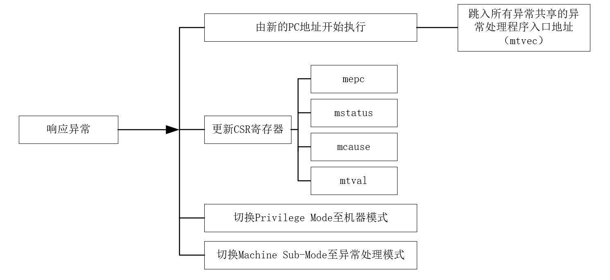
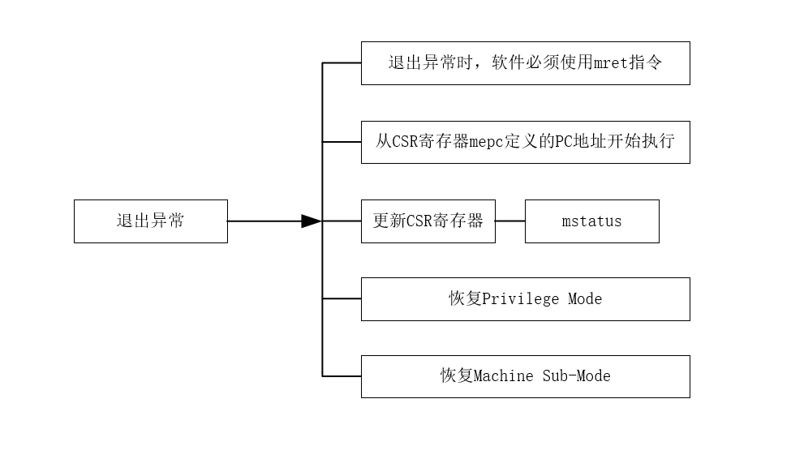

# **3. Bumblebee内核异常机制介绍**

## **3.1. 异常概述**

异常（Exception）机制，即处理器核在顺序执行程序指令流的过程中突然遇到了异常的事情而中止执行当前的程序，转而去处理该异常，其要点如下：

- 处理器遇到的“异常的事情”称为异常（Exception）。异常是由处理器内部事件或程序执行中的事件引起的，譬如本身硬件故障、程序故障，或者执行特殊的系统服务指令而引起的，简而言之是一种内因。
- 异常发生后，处理器会进入异常服务处理程序。

## **3.2. 异常屏蔽**

RISC-V架构中规定异常是不可以被屏蔽的，也就是说一旦发生了异常，处理器一定会停止当前操作转而进入异常处理模式。

## **3.3. 异常的优先级**

处理器内核可能存在多个异常同时发生的情形，因此异常也有优先级。异常的优先级如表 3-1中所示，异常编号数字越小的异常优先级越高。

## **3.4. 进入异常处理模式**

进入异常时，Bumblebee内核的硬件行为可以简述如下。注意，下列硬件行为在一个时钟周期内同时完成：

停止执行当前程序流，转而从CSR寄存器mtvec定义的PC地址开始执行。

更新相关CSR寄存器，分别是以下几个寄存器：

- mcause（Machine Cause Register）
- mepc（Machine Exception Program Counter）
- mtval（Machine Trap Value Register ）
- mstatus（Machine Status Register）
- 更新处理器内核的Privilege Mode以及Machine Sub-Mode。

异常响应总体过程如图 3-1所示。

​                                                                       **
图3-1异常响应总体过程
**

下文将分别予以详述。

### **3.4.1. 从mtvec定义的PC地址开始执行**

Bumblebee内核遇到异常后跳入的PC地址由CSR寄存器mtvec指定。

mtvec寄存器是一个可读可写的CSR寄存器，因此软件可以编程更改其中的值。mtvec寄存器的详细格式如表 7-3所示。

### **3.4.2. 更新CSR寄存器mcause**

Bumblebee内核在进入异常时，CSR寄存器mcause被 同时（硬件自动）更新，以反映当前的异常种类，软件可以通过读此寄存器查询造成异常的具体原因。

mcause寄存器的详细格式如表 7-6所示，其中低5位为异常编号域，用于指示各种不同的异常类型，如表 3-1所示。

​                                       **
表 3-1 mcause 寄存器华中的 Exception Code
**

| 异常编号（Exception Code） | 异常和中断类型                                            | 同步/异步  | 描述                                                         |
| -------------------------- | --------------------------------------------------------- | ---------- | ------------------------------------------------------------ |
| 0                          | 指令地址非对齐（Instruction address misaligned）          | 同步       | 指令PC地址非对齐。注意：该异常类型在配置了 “C” 扩展指令子集的处理器中不可能发生。 |
| 1                          | 指令访问错误（Instruction access fault）                  | 同步       | 取指令访存错误。                                             |
| 2                          | 非法指令（Illegal instruction）                           | 同步       | 非法指令。                                                   |
| 3                          | 断点（Breakpiont）                                        | 同步       | RISC-V 架构定义了 EBREAK 指令，当处理器执行到该指令时，会发生异常进入异常服务程序。该指令往往用于调试器（Debugger）使用，譬如设置断点 |
| 4                          | 读存储器地址非对齐（Load address misaligned）             | 同步       | Load 指令访存地址非对齐。注意：Bumblebee 内核不支持地址非对齐的数据存储器读写操作，因此当访问地址非对齐时会产生此异常。 |
| 5                          | 读存储器访问错误（Load access fault）                     | 非精确异步 | Load 指令访存错误                                            |
| 6                          | 写存储器和 AMO 地址非对齐（Store/AMO address misaligned） | 同步       | Store 或者 AMO 指令访存地址非对齐。注意：Bumblebee 内核不支持地址非对齐的数据存储器读写操作，因此当访问地址非对齐时会产生此异常。 |
| 7                          | 写存储器和 AMO 访问错误（Store/AMO access fault）         | 非精确异步 | Store 或者 AMO 指令访存错误。                                |
| 8                          | 用户模式环境调用（Environment call from U-mode）          | 同步       | User Mode 下执行 ecall 指令。RISC-V 架构定义了 ecall 指令，当处理器执行到该指令时，会发生异常进入异常服务程序。该指令往往供软件使用，强行进入异常模式。 |
| 11                         | 机器模式环境调用（Environment call from M-mode）          | 同步       | Machine Mode 下执行 ecall指令。RISC-V 架构定义了 ecall 指令，当处理器执行到该指令时，会发生异常进入异常服务程序。该指令往往供软件使用，强行进入异常模式。 |

### **3.4.3. 更新CSR寄存器mepc**

Bumblebee内核退出异常时的返回地址由CSR寄存器mepc（Machine Exception Program Counter）保存。在进入异常时，硬件将自动更新mepc寄存器的值，该寄存器将作为退出异常的返回地址，在异常结束之后，能够使用它保存的PC值回到之前被异常停止执行的程序点。

注意：

- 出现异常时，异常返回地址mepc的值被更新为当前发生异常的指令PC。
- 虽然mepc寄存器会在异常发生时自动被硬件更新，但是mepc寄存器本身也是一个可读可写的寄存器，因此软件也可以直接写该寄存器以修改其值。

### **3.4.4. 更新CSR寄存器mtval**

Bumblebee内核在进入异常时，硬件将自动更新CSR寄存器mtval（Machine Trap Value Register ），以反映引起当前异常的存储器访问地址或者指令编码：

- 如果是由存储器访问造成的异常，譬如遭遇硬件断点、取指令、存储器读写造成的异常，则将存储器访问的地址更新到mtval寄存器中。
- 如果是由非法指令造成的异常，则将该指令的指令编码更新到mtval寄存器中。

### **3.4.5. 更新CSR寄存器mstatus**

mstatus寄存器的详细格式如表 7-2所示，Bumblebee内核在进入异常时，硬件将自动更新CSR寄存器mstatus（Machine Status Register）的某些域：

- mstatus.MPIE域的值被更新为异常发生前mstatus.MIE域的值，如节和第8.2所示。mstatus.MPIE域的作用是在异常结束之后，能够使用mstatus.MPIE的值恢复出异常发生之前的mstatus.MIE值。
- mstatus.MIE域的值则被更新成为0（意味着进入异常服务程序后中断被全局关闭，所有的中断都将被屏蔽不响应）。
- mstatus.MPP域的值被更新为异常发生前的Privilege Mode，如节和第8.2所示。mstatus.MPP域的作用是在异常结束之后，能够使用mstatus.MPP的值恢复出异常发生之前的Privilege Mode。

### **3.4.6. 更新Privilege Mode**

异常需要在机器模式（Machine Mode）下处理，在进入异常时，处理器内核的Privilege Mode被更新为机器模式。

### **3.4.7. 更新Machine Sub-Mode**

Bumblebee内核的Machine Sub-Mode实时反映在CSR寄存器msubm.TYP域中。在进入异常时，处理器内核的Machine Sub-Mode被更新为异常处理模式，因此：

- CSR寄存器msubm.PTYP域的值被更新为异常发生前的Machine Sub-Mode（msubm.TYP域的值），如节和第8.2所示。msubm.PTYP域的作用是在异常结束之后，能够使用msubm.PTYP的值恢复出异常发生之前的Machine Sub-Mode值。
- CSR寄存器msubm.TYP域的值则被更新为“异常处理模式”如节和第8.2所示，以实时反映当前的模式已经是“异常处理模式”。

​                                            **
图 3-2进入/退出异常时CSR寄存器的变化
**

## **3.5. 退出异常处理模式**

当程序完成异常处理之后，最终需要从异常服务程序中退出。

由于异常处理处于Machine Mode下，所以退出异常时，软件必须使用mret指令。处理器执行mret指令后的硬件行为如下。注意，下列硬件行为在一个时钟周期内同时完成：

- 停止执行当前程序流，转而从CSR寄存器mepc定义的PC地址开始执行。
- 更新CSR寄存器mstatus（Machine Status Register）如节和第8.2所示，并更新处理器内核的Privilege Mode以及Machine Sub-Mode。

退出异常的总体过程如所图 3-3示。

​                                                               **
图 3-3 退出异常总体过程
**

下文将分别予以详述。

### **3.5.1. 从mepc定义的PC地址开始执行**

在进入异常时，mepc寄存器被同时更新，以反映当时遇到异常的指令PC值。通过这个机制，意味着mret指令执行后处理器回到了当时遇到异常的指令的PC地址，从而可以继续执行之前被中止的程序流。

注意：退出异常之前可能需要使用软件更新mepc的值。例如，如果异常由ecall或ebreak产生，由于mepc的值被更新为ecall或ebreak指令自己的PC。因此在异常返回时，如果直接使用mepc保存的PC值作为返回地址，则会再次跳回ecall或者ebreak指令，从而造成死循环（执行ecall或者ebreak指令导致重新进入异常）。正确的做法是在异常处理程序中软件改变mepc指向下一条指令，由于现在ecall/ebreak都是4字节指令，因此改写设定mepc=mepc+4即可。

### **3.5.2. 更新CSR寄存器mstatus**

mstatus寄存器的详细格式如表 7-2所示。在执行mret指令后，硬件将自动更新CSR寄存器mstatus的某些域：

- mstatus.MIE域的值被恢复为当前mstatus.MPIE的值。
- 当前mstatus.MPIE域的值则被更新为1。
- mstatus.MPP域的更新值分为以下两种情形：
  - 配置了用户模式U-mode时，mstatus.MPP被更新为0x0。
  - 没有配置用户模式U-mode时，mstatus.MPP被更新为0x11。

在进入异常时，mstatus.MPIE的值曾经被更新为异常发生前的mstatus.MIE值，如节和第8.2所示。而mret指令执行后，将mstatus.MIE域的值恢复为mstatus.MPIE的值。通过这个机制，则意味着mret指令执行后，处理器的mstatus.MIE值被恢复成异常发生之前的值（假设之前的mstatus.MIE值为1，则意味着中断被重新全局打开）。

### **3.5.3. 更新Privilege Mode**

在进入异常时，mstatus.MPP的值曾经被更新为异常发生前的Privilege Mode，而在执行mret指令后，处理器的Privilege Mode被恢复为mstatus.MPP的值，如节和第8.2所示。通过这个机制，保证了处理器回到了异常发生前的处理器的Privilege Mode。

### **3.5.4. 更新Machine Sub-Mode**

Bumblebee内核的Machine Sub-Mode实时反映在CSR寄存器msubm.TYP域中。在执行mret指令后，硬件将自动恢复处理器的Machine Sub-Mode为msubm.PTYP域的值：

- 在进入异常时，msubm.PTYP域的值曾经被更新为异常发生前的Machine Sub-Mode值。而使用mret指令退出异常后，硬件将处理器Machine Sub-Mode的值恢复为msubm.PTYP域的值，如图 4-2所示。通过这个机制，则意味着退出异常后，处理器的Machine Sub-Mode被恢复成异常发生之前的Machine Sub-Mode。

## **3.6. 异常服务程序**

当处理器进入异常后，即开始从mtvec寄存器定义的PC地址执行新的程序，该程序通常为异常服务程序，并且程序还可以通过查询mcause中的异常编号（Exception Code）决定进一步跳转到更具体的异常服务程序。譬如当程序查询mcause中的值为0x2，则得知该异常是非法指令错误（Illegal Instruction）引起的，因此可以进一步跳转到非法指令错误异常服务子程序中去。

注意：由于进入异常和退出异常机制中没有硬件自动保存和恢复上下文的操作，因此需要软件明确地使用（汇编语言编写的）指令进行上下文的保存和恢复。请结合MCU芯片的一个完整的异常服务程序代码示例对其进行理解。

## **3.7. 异常嵌套**

Bumblebee内核支持两级NMI/异常状态堆栈（Two Levels of NMI/Exception State Save Stacks），更多细节请参见4.6节。

