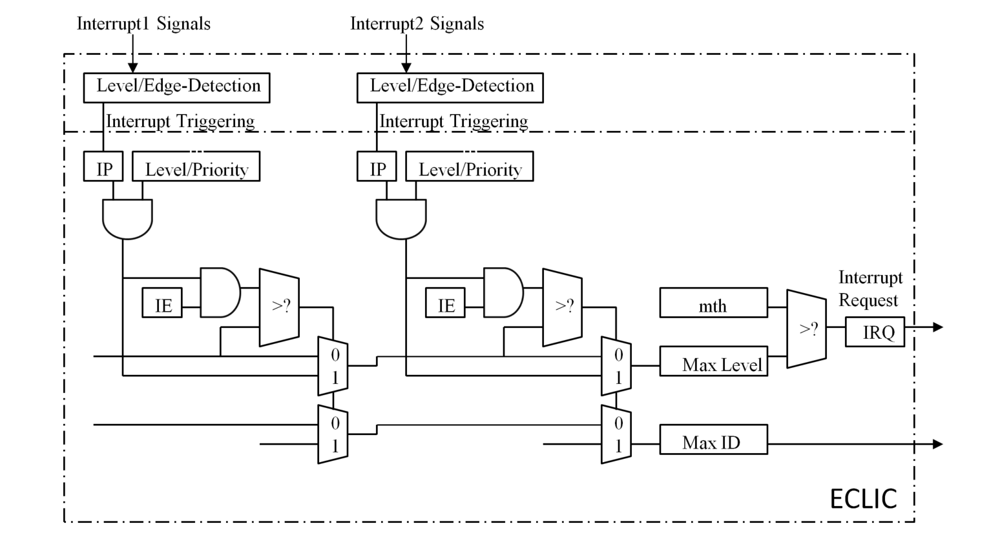
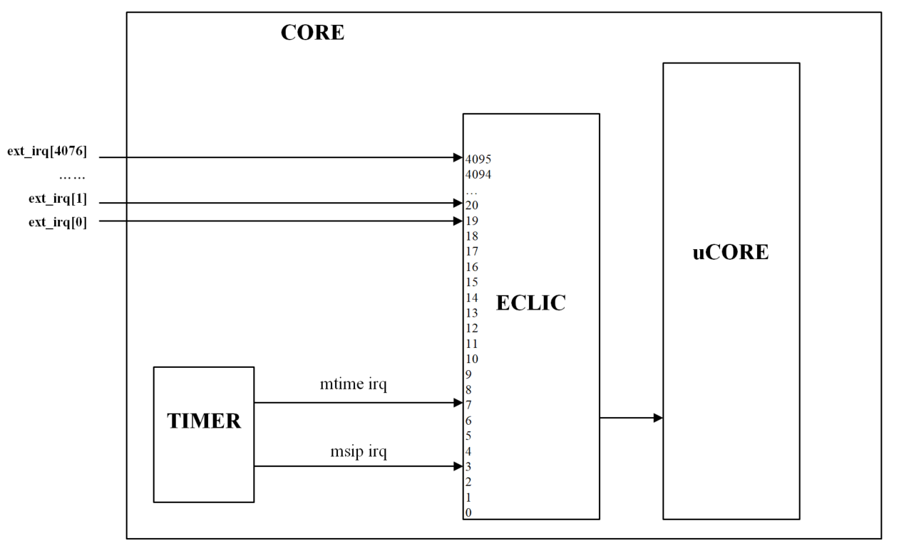
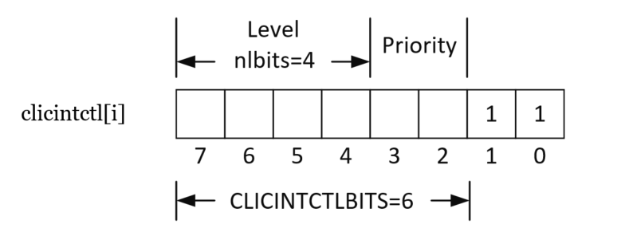
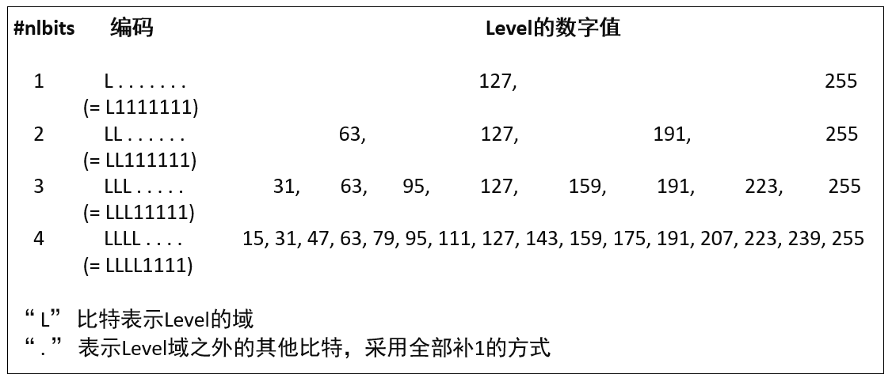

# **6. Bumblebee内核TIMER和ECLIC介绍**

## **6.1. TIMER介绍**

### **6.1.1. TIMER简介**

计时器单元（Timer Unit，TIMER），在Bumblebee内核中主要用于产生计时器中断（Timer Interrupt）和软件中断（Software Interrupt）。请参见第5.3.2.1节和第5.3.2.2节了解计时器中断与软件中断的详细信息。

### **6.1.2. TIMER寄存器**

TIMER是一个存储器地址映射的单元：

- TIMER单元在Bumblebee内核中的基地址请参见《Bumblebee内核简明数据手册》中的介绍。
- TIMER单元内寄存器和地址偏移量如表 6-1中所示。

​                                                **
表 6-1 TIMER寄存器的存储器映射地址
**

| 模块内偏移地址 | 读写属性 | 寄存器名称  | 复位默认值 | 功能描述                                                     |
| -------------- | -------- | ----------- | ---------- | ------------------------------------------------------------ |
| 0x0            | 可读可写 | mtime_lo    | 0x00000000 | 反映计时器mtime的低32位值，参见第6.1.3节了解其详细介绍。     |
| 0x4            | 可读可写 | mtime_hi    | 0x00000000 | 反映计时器mtime的高32位值，参见6.1.3节了解其详细介绍。       |
| 0x8            | 可读可写 | mtimecmp_lo | 0xFFFFFFFF | 配置计时器的比较值mtimecmp低32位，参见第6.1.5节了解其详细介绍。 |
| 0xC            | 可读可写 | mtimecmp_hi | 0xFFFFFFFF | 配置计时器的比较值mtimecmp高32位，参见第6.1.5节了解其详细介绍。 |
| 0xFF8          | 可读可写 | mstop       | 0x00000000 | 控制计时器的暂停，参见第6.1.4节了解其详细介绍。              |
| 0xFFC          | 可读可写 | msip        | 0x00000000 | 生成软件中断，参见第6.1.6节了解其详细介绍。                  |

注意：

- TIMER的寄存器只支持操作尺寸（Size）为word的对齐读写访问。
- TIMER的寄存器区间为0x00 ~ 0xFF，除了上表中列出的寄存器之外的其他地址内的值为常数0。

下文对各寄存器的功能和使用进行详细描述。

### **6.1.3. 通过mtime寄存器进行计时**

TIMER可以用于实时计时，要点如下：

- TIMER中实现了一个64位的mtime寄存器，由{mtime_hi，mtime_lo}拼接而成，该寄存器反映了64位计时器的值。计时器根据低速的输入节拍信号进行自增计数，计时器默认是打开的，因此会一直进行计数。
- 在Bumblebee内核中，此计数器的自增频率由处理器的输入信号mtime_toggle_a控制，请参见文档《Bumblebee内核简明数据手册》了解该输入信号的详情。

### **6.1.4. 通过mstop寄存器暂定计时器**

由于TIMER的计时器上电后默认会一直进行自增计数，为了在某些特殊情况下关闭此计时器计数，TIMER中实现了一个mstop寄存器。如表 6-2中所示，mstop寄存器只有最低位为有效位，该有效位直接作为计时器的暂停控制信号，因此，软件可以通过将mstop寄存器设置成1将计时器暂停计数。

​                                                    **
表 6-2 寄存器mstop的比特域
**

| 域名     | 比特位 | 属性         | 复位值 | 描述                                                         |
| -------- | ------ | ------------ | ------ | ------------------------------------------------------------ |
| Reserved | 7:1    | 只读，写忽略 | N/A    | 未使用的域，值为常数0                                        |
| TIMESTOP | 0      | 可读可写     | 0      | 控制计时器运行或者暂停。如果该域的值为1，则计时器暂停计数，否则正常自增计数。 |

### **6.1.5. 通过mtime和mtimecmp寄存器生成计时器中断**

TIMER可以用于生成计时器中断，要点如下：

- TIMER中实现了一个64位的mtimecmp寄存器，由{mtimecmp_hi，mtimecmp_lo}拼接而成，该寄存器作为计时器的比较值，假设计时器的值mtime大于或者等于mtimecmp的值，则产生计时器中断。软件可以通过改写mtimecmp或者mtime的值（使得mtimecmp大于mtime的值）来清除计时器中断。

注意：计时器中断是连接到ECLIC单元进行统一管理，有关ECLIC的详情请参见第6.2节。

### **6.1.6. 通过msip寄存器生成软件中断**

TIMER可以用于生成软件中断。TIMER中实现了一个msip寄存器，如表 6-3中所示，msip寄存器只有最低位为有效位，该有效位直接作为软件中断，因此：

- 软件写通过写1至msip寄存器产生软件中断；
- 软件可通过写0至msip寄存器来清除该软件中断。

注意：软件中断是连接到ECLIC单元进行统一管理，有关ECLIC的详情请参见第6.2节。

​                                                    **
表 6-3 寄存器msip的比特域
**

| 域名     | 比特位 | 属性         | 复位值 | 描述                  |
| -------- | ------ | ------------ | ------ | --------------------- |
| Reserved | 7:1    | 只读，写忽略 | N/A    | 未使用的域，值为常数0 |
| MSIP     | 0      | 可读可写     | 0      | 该域用于产生软件中断  |

## **6.2. ECLIC介绍**

Bumblebee内核支持在RISC-V标准CLIC基础上优化而来的“改进型内核中断控制器（Enhanced Core Local Interrupt Controller，ECLIC）”，用于管理所有的中断源。

注意：

- ECLIC只服务于一个处理器内核，为该处理器内核私有。
- ECLIC的软件编程模型也向后兼容标准的CLIC。

### **6.2.1. ECLIC简介**

​                                                                **
图 6-1 ECLIC逻辑结构示意图
**

ECLIC用于对多个内部和外部中断源进行仲裁、发送请求并支持中断嵌套。ECLIC的寄存器如表 6-5所述，逻辑结构如图 6-1所示，相关概念如下：

- ECLIC中断目标
- ECLIC中断源
- ECLIC中断源的编号
- ECLIC的寄存器
- ECLIC中断源的使能位
- ECLIC中断源的等待标志位
- ECLIC中断源的电平或边沿属性
- ECLIC中断源的级别和优先级
- ECLIC中断源的向量或非向量处理
- ECLIC中断目标的阈值级别
- ECLIC中断的仲裁机制
- ECLIC中断的响应、嵌套、咬尾机制

下文将分别予以详述。

### **6.2.2. ECLIC中断目标**

ECLIC单元生成一根中断线，发送给处理器内核（作为中断目标），其关系结构如图 6-2所示。

​                                                                **
图 6-2 ECLIC关系结构图
**

### **6.2.3. ECLIC中断源**

如图 6-2所示，ECLIC理论上从编程模型上可以支持多达4096个中断源（Interrupt Source）。ECLIC为每个中断源定义了如下特性和参数：

- 编号（ID）
- 使能位（IE）
- 等待标志位（IP）
- 电平或边沿属性（Level or Edge-Triggered）
- 级别和优先级（Level and Priority）
- 向量或非向量处理（Vector or Non-Vector Mode）

下文分别予以介绍。

### **6.2.4. ECLIC中断源的编号（ID）**

ECLIC为每个中断源分配了一个独一无二的编号（ID）。譬如，假设某ECLIC的硬件实现真正支持4096个ID，则ID应为0至4095。注意：

- 在Bumblebee内核中，中断ID编号0至18的中断被预留作为了内核特殊的内部中断。
- 普通外部中断分配的中断源ID从19开始，用户可以用于连接外部中断源。

详细介绍如表 6-4中所示。

​                                                  **
表 6-4 ECLIC中断源编号和分配
**

| ECLIC中断编号 | 功能               | 中断源介绍                                      |
| ------------- | ------------------ | ----------------------------------------------- |
| 0             | 预留               | Bumblebee内核没有使用该中断。                   |
| 1             | 预留               | Bumblebee内核没有使用该中断。                   |
| 2             | 预留               | Bumblebee内核没有使用该中断。                   |
| 3             | 软件中断           | Bumblebee内核的TIMER单元生成的软件中断。        |
| 4             | 预留               | Bumblebee内核没有使用该中断。                   |
| 5             | 预留               | Bumblebee内核没有使用该中断。                   |
| 6             | 预留               | Bumblebee内核没有使用该中断。                   |
| 7             | 计时器中断         | Bumblebee内核的TIMER单元生成的计时器中断。      |
| 8             | 预留               | Bumblebee内核没有使用该中断。                   |
| 9             | 预留               | Bumblebee内核没有使用该中断。                   |
| 10            | 预留               | Bumblebee内核没有使用该中断。                   |
| 11            | 预留               | Bumblebee内核没有使用该中断。                   |
| 12            | 预留               | Bumblebee内核没有使用该中断。                   |
| 13            | 预留               | Bumblebee内核没有使用该中断。                   |
| 14            | 预留               | Bumblebee内核没有使用该中断。                   |
| 15            | 预留               | Bumblebee内核没有使用该中断。                   |
| 16            | 预留               | Bumblebee内核没有使用该中断。                   |
| 17            | 存储器访问错误中断 | Bumblebee内核存储器访问错误转化成为的内部中断。 |
| 18            | 预留               | Bumblebee内核没有使用该中断。                   |
| 19~4095       | 外部中断           | 普通外部中断供用户连接使用。                    |

注意：

- 虽然ECLIC从编程模型上支持最多4096个中断源，但是实际硬件支持的中断源数目反映在信息寄存器clicinfo.NUM_INTERRUPT中。

### **6.2.5. ECLIC的寄存器**

ECLIC是一个存储器地址映射的单元：

- ECLIC单元在Bumblebee内核中的基地址请参见《Bumblebee内核简明数据手册》中的介绍。
- ECLIC单元内的寄存器和地址偏移量如表 6-5中所示。

​                                                  **
表 6-5 ECLIC寄存器的单元内地址偏移量
**

|            | 属性         | 名称           | 宽度 |
| ---------- | ------------ | -------------- | ---- |
| 0x0000     | 可读可写     | cliccfg        | 8位  |
| 0x0004     | 只读，写忽略 | clicinfo       | 32位 |
| 0x000b     | 可读可写     | mth            | 8位  |
| 0x1000+4*i | 可读可写     | clicintip[i]   | 8位  |
| 0x1001+4*i | 可读可写     | clicintie[i]   | 8位  |
| 0x1002+4*i | 可读可写     | clicintattr[i] | 8位  |
| 0x1003+4*i | 刻度科学     | clicintctl[i]  | 8位  |

注意：

- 上述的i表示中断的ID编号，带有[i]后缀的寄存器表示这是针对每个中断源会有一份独立的寄存器。
- ECLIC的寄存器支持操作尺寸（Size）为byte、half-word、或word的对齐读写访问。
- 向上述“只读”寄存器进行写操作会被忽略，但是不会产生总线出错异常。
- 实际的ECLIC可能没有配置4096个中断源，那么不存在的中断源对应寄存器的值为常数0。
- ECLIC单元内寄存器区间为0x0000 ~ 0xFFFF，除了上表中列出的寄存器之外的其他地址内的值为常数0。

下文对各个寄存器进行详细介绍。

#### **6.2.5.1 寄存器cliccfg**

cliccfg寄存器是全局性的配置寄存器，软件可以通过改写该寄存器配置若干全局性的参数，其具体比特域的信息请参见表 6-6中所示。

​                                                **
表 6-6 寄存器cliccfg的比特域
**

| 域名     | 比特位 | 属性         | 复位值 | 描述                                                         |
| -------- | ------ | ------------ | ------ | ------------------------------------------------------------ |
| Reserved | 7:5    | 只读，写忽略 | N/A    | 未使用的域，值为常数0                                        |
| nlbits   | 4:1    | 可读可写     | 0      | 用于指定clicintctl[i]寄存器Level域的比特数，参见第6.2.9节了解其详细介绍。 |
| Reserved | 0      | 只读，写忽略 | N/A    | 未使用的域，值为常数1                                        |

#### **6.2.5.2 寄存器clicinfo**

clicinfo寄存器是全局性的信息寄存器，软件可以通过读该寄存器查看若干全局性的参数，其具体比特域的信息请参见表 6-7中所示。

​                                                **
表 6-7 寄存器clicinfo的比特域
**

| 域名           | 比特位 | 属性         | 复位值 | 描述                                                         |
| -------------- | ------ | ------------ | ------ | ------------------------------------------------------------ |
| Reserved       | 31:25  | 只读，写忽略 | N/A    | 未使用的域，值为常数0                                        |
| CLICINTCTLBITS | 24:21  | 只读，写忽略 | N/A    | 用于指定clicintctl[i]寄存器中有效位的比特数，参见第6.2.9节了解其详细介绍。 |
| VERSION        | 20:13  | 只读，写忽略 | N/A    | 硬件实现的版本号                                             |
| NUM_INTERRUPT  | 12:0   | 只读，写忽略 | N/A    | 硬件支持的中断源数目                                         |

#### **6.2.5.3 寄存器mth**

mth寄存器是中断目标的阈值级别寄存器，软件可以通过改写该寄存器配置中断目标的阈值级别，其具体比特域的信息请参见表 6-8中所示。

​                                                  **
表 6-8 寄存器mth的比特域
**

| 域名 | 比特位 | 属性     | 复位值 | 描述                                                     |
| ---- | ------ | -------- | ------ | -------------------------------------------------------- |
| mth  | 7:0    | 可读可写 | N/A    | 中断目标的阈值级别寄存器，参见第6.2.11节了解其详细介绍。 |

#### **6.2.5.4 寄存器clicintip[i]**

clicintip[i]寄存器是中断源的等待标志寄存器，其具体比特域的信息请参见表 6-9中所示。

​                                             **
表 6-9 寄存器clicintip[i]的比特域
**

| 域名     | 比特位 | 属性         | 复位值 | 描述                                              |
| -------- | ------ | ------------ | ------ | ------------------------------------------------- |
| Reserved | 7:1    | 只读，写忽略 | N/A    | 未使用的域，值为常数0                             |
| IP       | 0      | 可读可写     | 0      | 中断源的等待标志位，参见第6.2.7节了解其详细介绍。 |

#### **6.2.5.5 寄存器clicintie[i]**

clicintie[i]寄存器是中断源的使能寄存器，其具体比特域的信息请参见表 6-10中所示。

​                                           **
表 6-10 寄存器clicintip[i]的比特域
**

| 域名     | 比特位 | 属性         | 复位值 | 描述                                          |
| -------- | ------ | ------------ | ------ | --------------------------------------------- |
| Reserved | 7:1    | 只读，写忽略 | N/A    | 未使用的域，值为常数0                         |
| IE       | 0      | 可读可写     | 0      | 中断源的使能位，参见第6.2.6节了解其详细介绍。 |

### **6.2.6. ECLIC中断源的使能位（IE）**

如图 6-2所示，ECLIC为每个中断源分配了一个中断使能位（IE），反映在寄存器clicintie[i].IE中，其功能如下：

- 每个中断源的clicintie[i]寄存器是存储器地址映射的可读可写寄存器，从而使得软件可以对其编程。
- 如果clicintie[i]寄存器被编程配置成为0，则意味着此中断源被屏蔽。
- 如果clicintie[i]寄存器被编程配置成为1，则意味着此中断源被打开。

### **6.2.7. ECLICA中断源的等待标志位（IP）**

如图 6-2所示，ECLIC为每个中断源分配了一个中断等待标志位（IP），反映在寄存器clicintip[i].IP中，其功能如下：

- 如果某个中断源的IP位为高，则表示该中断源被触发。中断源的触发条件取决于它是电平触发还是边沿触发的属性，请参见第6.2.8节的详细介绍。
- 中断源的IP位软件可读可写，软件写IP位的行为取决于它是电平触发还是边沿触发的属性，请参见第6.2.8节的详细介绍。
- 对于边沿触发的中断源，其IP还可能存在硬件自清的行为，请参见第6.2.8节的详细介绍。

### **6.2.8. ECLIC中断源的电平或边沿属性（Level or Edge-Triggered）**

如图 6-2所示，ECLIC的每个中断源均可以设置电平触发或者边沿触发的属性（通过寄存器clicintattr[i]的trig域），其要点如下：

- 当clicintattr[i].trig[0] == 0时，设置该中断属性为电平触发的中断：
  - 如果该中断源被配置为电平触发，中断源的IP位会实时反映该中断源的电平值。
  - 如果该中断源被配置为电平触发，由于中断源的IP位实时反映该中断源的电平值，所以软件对该中断IP位的写操作会被忽略，即，软件无法通过写操作设置或者清除IP位的值。如果软件需要清除中断，只能通过清除中断的最终源头的方式进行。
- 当clicintattr[i].trig[0] == 1和clicintattr[i].trig[1] == 0时，设置该中断属性为上升沿触发的中断：
  - 如果该中断源被配置为上升沿触发，则ECLIC检测到该中断源的上升沿时，该中断源在ECLIC中被触发，该中断源的IP位被置高。
  - 如果该中断源被配置为上升沿触发，软件对该中断IP位的写操作会生效，即，软件可以通过写操作设置或者清除IP位的值。
  - 注意：对于上升沿触发的中断而言，为了能够提高中断处理的效率，当该中断被响应，处理器内核跳入中断服务程序（Interrupt Service Routines，ISR）之时，ECLIC的硬件会自动清除该中断的IP位，从而无需软件在ISR内部对该中断的IP位进行清除。
- 当clicintattr[i].trig[0] == 1和clicintattr[i].trig[1] == 1时，设置该中断属性为下降沿触发的中断：
  - 如果该中断源被配置为下降沿触发，则ECLIC检测到该中断源的下降沿时，该中断源在ECLIC中被触发，该中断源的IP位被置高。
  - 如果该中断源被配置为下降沿触发，软件对该中断IP位的写操作会生效，即，软件可以通过写操作设置或者清除IP位的值。
  - 注意：对于下降沿触发的中断而言，为了能够提高中断处理的效率，当该中断被响应，处理器内核跳入中断服务程序（Interrupt Service Routines，ISR）之时，ECLIC的硬件会自动清除该中断的IP位，从而无需软件在ISR内部对该中断的IP位进行清除。

### **6.2.9. ECLIC中断源的级别和优先级（Level and Priority）**

如图 6-2所示，ECLIC的每个中断源均可以设置特定的级别和优先级（通过寄存器clicintctl[i]），其要点如下：

- 每个中断源的clicintctl[i]寄存器理论上有8位宽，其中硬件真正实现的位有效位数由clicinfo寄存器的CLICINTCTLBITS域来指定。譬如，假设clicinfo.CLICINTCTLBITS域的值为6，则表示clicintctl[i]寄存器只有高6位是真正的有效位，最低2位的值为常数1，如图 6-3中示例所示。
  - 注意：CLICINTCTLBITS域的值是只读的固定常数，软件无法对其进行编程改写。其理论上的合理范围是2 <= CLICINTCTLBITS <= 8，具体的实际值由处理器内核的硬件实现决定。
- 在clicintctl[i]寄存器的有效位中，包含两个动态的域，分别用于指定该中断源的级别（Level）和优先级（Priority）。Level域的宽度由cliccfg寄存器的nlbits域来指定。譬如，假设cliccfg.nlbits域的值为4，则表示clicintctl[i]寄存器有效位的高4位是Level域，其他的低位有效位为Priority域，如图 6-3中示例所示。
  - 注意：cliccfg.nlbits域的值是可读可写域，软件可以对其进行编程改写。

​                                                            **
图 6-3 寄存器clicintctl[i]的格式示例
**

- 中断源的级别（Level）相关的要点如下：
  - Level的数字值采取左对齐的方式进行解读，有效位宽（由cliccfg.nlbits指定）之外的低位全部采用补常数1的方式填充，如图 6-4中示例所示。
    - 注意：如果cliccfg.nlbits > clicinfo.CLICINTCTLBITS，则意味着nlbits指示的位数超出了clicintctl[i]寄存器的有效位，则超出的位全部采用补常数1的方式填充。
    - 注意：如果cliccfg.nlbits = 0，Level的数字值会被认为是固定的255。如图 6-5中示例所示。
  - Level的数字值越大，则表示其级别越高，注意：
    - 高级别的中断可以打断低级别的中断处理，从而形成中断嵌套，请参见第5.11节的详细介绍。
    - 多个中断同时等待（IP位为高），ECLIC需要仲裁决定哪个中断被发送给内核进行处理，仲裁时需要参考每个中断源的Level数字值。请参见第5.5节的详细介绍。

​                                                             **
图 6-4 Level的数字值解读方式
**

​                                                             **
图 6-5 cliccfg设置的若干示例
**

- 中断源的优先级（Priority）相关的要点如下：
  - Priority的数字值也采取左对齐的方式进行解读，有效位宽（clicinfo.CLICINTCTLBITS -cliccfg.nlbits）之外的低位全部采用补常数1的方式填充。
  - Priority的数字值越大，则表示其优先级越高，注意：
    - 中断优先级（Priority）不参与中断嵌套的判断，即中断能否嵌套与中断优先级（Priority）的数值大小没有关系，而是与中断级别（Level）的数值大小有关。
    - 多个中断同时Pending时，ECLIC需要仲裁决定哪个中断被发送给内核进行处理，仲裁时需要参考每个中断源的Priority数字值。请参见第6.2.12节的详细介绍。

### **6.2.10. ECLIC中断源的向量或非向量处理（Vector or Non-Vector Mode）**

ECLIC的每个中断源均可以设置成向量或者非向量处理（通过寄存器clicintattr[i]的shv域），其要点如下：

- 如果被配置成为向量处理模式，则该中断被处理器内核响应后，处理器直接跳入该中断的向量入口（Vector Table Entry）存储的目标地址。有关中断向量处理模式的详细介绍，请参见第5.13节。
- 如果被配置成为非向量处理模式，则该中断被处理器内核响应后，处理器直接跳入所有中断共享的入口地址。有关中断非向量处理模式的详细介绍，请参见第5.13节。

### **6.2.11. ECLIC中断目标的阈值级别**

如图 6-1中所示，ECLIC可以设置特定的中断目标的阈值级别（mth），其要点如下：

- mth寄存器是完整的8位寄存器，所有位均可读可写，软件可以通过写此寄存器配置目标阈值。注意：该阈值表征的是一种级别（Level）的数字值。
- ECLIC最终仲裁出的中断的“级别（Level）数字值”只有高于“mth寄存器中的值”，该中断才能够被发送给处理器内核。

### **6.2.12. ECLIC中断的仲裁机制**

如图 6-2所示，ECLIC对其所有中断源进行仲裁选择的原则如下：

- 只有满足下列所有条件的中断源才能参与仲裁：
  - 中断源的使能位（clicintie[i]寄存器）必须为1。
  - 中断源的等待标志位（clicintip[i]寄存器）必须为1。
- 从所有参与仲裁的中断源中进行仲裁的规则为：
  - 首先判断级别（Level），Level数字值越大的中断源，其仲裁优先级越高。
  - 如果Level相等，则其次判断优先级（Priority），Priority数字值越大的中断源，其仲裁优先级越高。
  - 如果Level和Priority都相等，则再次判断判断中断ID，中断ID越大的中断源，其仲裁优先级越高。
- 如果最后仲裁出的中断源的Level数字值高于中断目标的阈值级别（mth），则产生最终的中断请求，将通往处理器内核的中断请求信号拉高。

### **6.2.13. ECLIC中断的响应、嵌套、咬尾机制**

ECLIC中断请求发送给处理器内核之后，处理器内核将对其进行响应。通过ECLIC和内核协同，可以支持中断嵌套、快速咬尾等等机制。请参见第5.6节、第5.11节、第5.12节的详细介绍。

