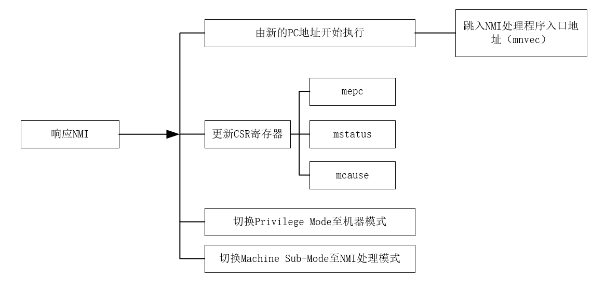
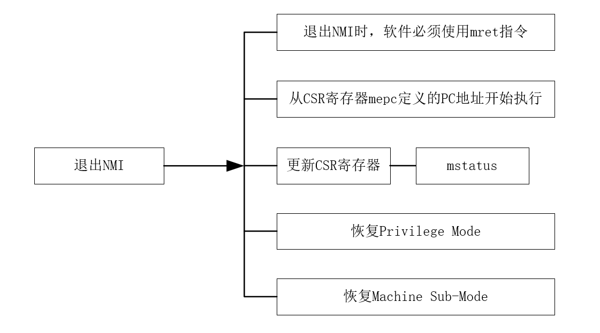
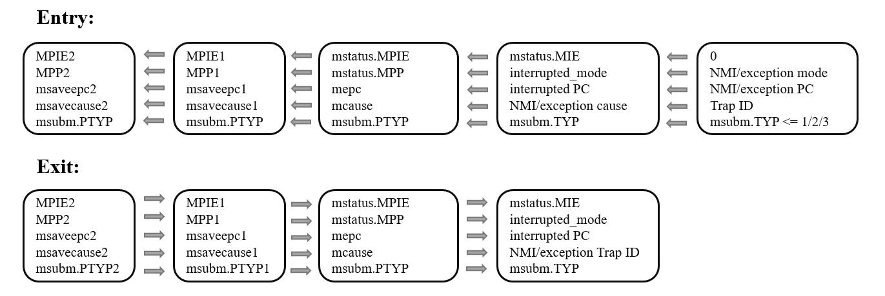

# **4. Bumblebee内核NMI机制介绍**

## **4.1. NMI概述**

NMI（Non-Maskable Interrupt）是处理器内核的一根特殊的输入信号，往往用于指示系统层面的紧急错误（譬如外部的硬件故障等）。在遇到NMI之后，处理器内核应该立即中止执行当前的程序，转而去处理该NMI错误。

## **4.2. NMI屏蔽**

Bumblebee内核中NMI是不可以被屏蔽的，也就是说一旦发生了NMI，处理器一定会停止当前操作转而处理NMI。

## **4.3. 进入NMI处理模式**

进入NMI处理模式时，Bumblebee内核的硬件行为可以简述如下。注意，下列硬件行为在一个时钟周期内同时完成：

- 停止执行当前程序流，转而从CSR寄存器mnvec定义的PC地址开始执行。
- 更新相关CSR寄存器，分别是以下几个寄存器：
  - mepc（Machine Exception Program Counter ）
  - mstatus（Machine Status Register）
  - mcause（Machine Cause Register）
- 更新处理器内核的Privilege Mode以及Machine Sub-Mode。
- NMI响应总体过程如图 4-1所示。

​                                                          **
图 4-1 NMI 响应总体过程
**

下文将分别予以详述。

### **4.3.1. 从mnvec定义的PC地址开始执行**

Bumblebee内核遇到NMI后跳入的PC地址由CSR寄存器mnvec指定。mnvec寄存器的值有以下两种情况：

- 当mmisc_ctl[9]=1时，mnvec寄存器的值等于mtvec，即NMI与异常拥有相同的Trap入口地址。
- 当mmisc_ctl[9]=0时， mnvec寄存器的值等于reset_vector，reset_vector为处理器被reset后的PC的值。

### **4.3.2. 更新CSR寄存器mepc**

Bumblebee内核退出NMI时的返回地址由CSR寄存器mepc（Machine Exception Program Counter）保存。在进入NMI时，硬件将自动更新mepc寄存器的值，该寄存器将作为退出NMI的返回地址，在NMI结束之后，能够使用它保存的PC值回到之前被停止执行的程序点。

注意：

- 出现NMI时，NMI返回地址mepc被指向下一条尚未执行的指令（因为NMI时的指令已经被正确执行）。那么在退出NMI后，程序便会回到之前的程序点，从下一条指令开始重新执行。
- 虽然mepc寄存器会在NMI发生时自动被硬件更新，但是mepc寄存器本身也是一个可读可写的寄存器，因此软件也可以直接写该寄存器以修改其值。

### **4.3.3. 更新CSR寄存器mcause**

mcause寄存器的详细格式如表 7-6所示。Bumblebee内核在进入NMI时，硬件自动保存当前Trap的ID到mcause，以表明Trap的原因。中断、异常以及NMI都有各自特殊的Trap ID。NMI的Trap ID有以下两种值：

- 当mmisc_ctl[9]=1时，NMI Trap ID为0xfff。
- 当mmisc_ctl[9]=0时，NMI Trap ID为 0x1。

通过给每个Trap分配特定的Trap ID，可以识别Trap的原因，软件可以根据Trap的原因来设计特定的处理程序处理Trap。

### **4.3.4. 更新CSR寄存器mstatus**

mstatus寄存器的详细格式如表 7-2所示， Bumblebee内核在进入NMI时，硬件将自动更新CSR寄存器mstatus的某些域：

- mstatus.MPIE域的值被更新为NMI发生前mstatus.MIE域的值，如图 4-2所示。mstatus.MPIE域的作用是在NMI结束之后，能够使用mstatus.MPIE的值恢复出NMI发生之前的mstatus.MIE值。
- mstatus.MIE域的值则被更新成为0（意味着进入NMI服务程序后中断被全局关闭，所有的中断都将被屏蔽不响应）。
- mstatus.MPP域的值被更新为NMI发生前的Privilege Mode。保存mstatus.MPP域的作用时在NMI结束之后，能够使用mstatus.MPP的值恢复出NMI发生前的Privilege Mode。

### **4.3.5. 更新Privilege Mode**

NMI处理是在机器模式（Machine Mode）下完成的，所以在进入NMI时，处理器内核的特权模式（Privilege Mode）切换成机器模式。

### **4.3.6. 更新Machine Sub-Mode**

Bumblebee内核的Machine Sub-Mode实时反映在CSR寄存器msubm.TYP域中。在进入NMI时，处理器内核的Machine Sub-Mode被更新为NMI处理模式，因此：

- CSR寄存器msubm.PTYP域的值被更新为NMI发生前的Machine Sub-Mode（msubm.TYP域的值），如图 4-2所示。msubm.PTYP域的作用是在NMI结束之后，能够使用msubm.PTYP的值恢复出NMI发生之前的Machine Sub-Mode值。
- CSR寄存器msubm.TYP域的值则被更新为“NMI处理模式”如图 4-2所示，以实时反映当前的模式已经是“NMI处理模式”。

​                                                  **
图 4-2 进入/退出 NMI 时 CSR 寄存器的变化
**

## **4.4. 退出NMI处理模式**

当程序完成NMI处理之后，最终需要从NMI服务程序中退出，并返回主程序。

由于NMI处理处于Machine Mode下，所以在退出NMI时，软件必须使用mret指令。处理器执行mret指令后的硬件行为如下。注意，下列硬件行为在一个时钟周期内同时完成：

- 停止执行当前程序流，转而从CSR寄存器mepc定义的PC地址开始执行。
- 更新CSR寄存器mstatus。
- 更新Privilege Mode以及Machine Sub-Mode。

退出NMI的总体过程如图 4-3所示。

​                                                            **
图 4-3 退出 NMI 总体过程
**

下文将分别予以详述。

### **4.4.1. 从mepc定义的PC地址开始执行**

在进入NMI时，mepc寄存器被同时更新，以反映当时遇到NMI的下一条指令的PC值。通过这个机制，意味着mret指令执行后处理器回到了当时遇到NMI的下一条指令的PC地址，从而可以继续执行之前被中止的程序流。

### **4.4.2. 更新CSR寄存器mstatus**

mstatus寄存器的详细格式如表 7-2所示，在执行mret指令后，硬件将自动更新CSR寄存器mstatus某些域：

- mstatus.MIE域的值被恢复为当前mstatus.MPIE的值。
- mstatus.MPIE域的值则被更新为1。
- mstatus.MPP域的更新值分为以下两种情形：
  - 配置了用户模式U-mode时，mstatus.MPP被更新为0x0。
- 没有配置用户模式U-mode时，mstatus.MPP被更新为0x11。

在进入NMI时，mstatus.MPIE的值曾经被更新为NMI发生前的mstatus.MIE值。而mret指令执行后，将mstatus.MIE的值恢复为mstatus.MPIE的值，如图 4-2所示。通过这个机制，则意味着mret指令执行后，处理器的mstatus.MIE值被恢复成NMI发生之前的值（假设之前的mstatus.MIE值为1，则意味着中断被重新全局打开）。

### **4.4.3. 更新Privilege Mode**

在进入NMI时，mstatus.MPP的值曾经被更新为NMI发生前的Privilege Mode，而在执行mret指令后，处理器的Privilege Mode被恢复为mstatus.MPP的值，如图 4-2所示。通过这个机制，保证了处理器回到了NMI发生前的处理器的Privilege Mode。

### **4.4.4. 更新Machine Sub-Mode**

Bumblebee内核的Machine Sub-Mode实时反映在CSR寄存器msubm.TYP域中。在执行mret指令后，硬件将自动恢复处理器的 Machine Sub-Mode为msubm.PTYP 域的值：

- 在进入NMI时，msubm.PTYP域的值曾经被更新为NMI发生前的Machine Sub-Mode值。而使用mret 指令退出NMI后，硬件将处理器 Machine Sub-Mode 的值恢复为msubm.PTYP域的值，如图 4-2 所示。通过这个机制，则意味着退出NMI后，处理器的Machine Sub-Mode被恢复成NMI发生之前的 Machine Sub-Mode。

## **4.5. NMI服务程序**

当处理器进入NMI后，即开始从mnvec寄存器定义的PC地址执行新的程序，该程序通常为NMI服务程序。

注意：由于进入NMI和退出NMI机制中没有硬件自动保存和恢复上下文的操作，因此需要软件明确地使用（汇编语言编写的）指令进行上下文的保存和恢复。请结合MCU芯片的一个完整的NMI服务程序代码示例对其进行理解。

## **4.6. NMI/异常嵌套**

Bumblebee内核自定义了如图 4-4所示的两级NMI/异常状态堆栈（Two Levels of NMI/Exception State Save Stacks），至多保存三级NMI/异常的处理器状态，可以实现二级可恢复的NMI/异常嵌套。

注意：由于处理器器处于NMI状态时，NMI的响应在硬件上被屏蔽掉了，因此NMI无法实现自我嵌套。Bumblebee内核的NMI/异常嵌套只支持以下3种嵌套：

- NMI嵌套异常
- 异常嵌套异常
- 异常嵌套NMI

​                             **
图 4-4 Bumblebee 内核两级 NMI/异常状态堆栈机制示意图
**

### **4.6.1. 进入NMI/异常嵌套**

响应NMI与异常时，Bumblebee内核的硬件行为如图 4-4所示，可以简述如下。

- 停止执行当前程序流，转而从新的PC地址开始执行。
  - 如果响应的是异常则从mtvec所存储的PC地址开始执行。
  - 如果响应的是NMI则从mnvec所存储的PC地址开始执行。
- 更新相关CSR寄存器，分别是以下几个寄存器及其相关的域：
  - mepc: 记录当前NMI/异常发生前的PC，退出NMI/异常时可从mepc恢复NMI/异常发生前的PC。
  - msaveepc1：第一级NMI/异常状态堆栈记录第一级嵌套NMI/异常（被当前NMI/异常嵌套的NMI/异常）发生前的PC，亦即当前NMI/异常发生前的mepc值，退出NMI/异常时可从msaveepc1恢复mepc的值。
  - msaveepc2: 第二级NMI/异常状态堆栈记录第二级嵌套NMI/异常（被第一级嵌套NMI/异常嵌套的NMI/异常）发生前的PC，亦即当前NMI/异常发生前的msaveepc1的值，退出NMI/异常时可从msaveepc2恢复msaveepc1的值。
  - mstatus:
    - MPIE：记录当前NMI/异常发生之前的MIE。
    - MPP: 记录当前NMI/异常发生之前的Privilege Mode。
  - msavestatus:
    - MPIE1：第一级NMI/异常状态堆栈记录第一级嵌套NMI/异常发生前的MIE，亦即当前NMI/异常发生前的MPIE，退出NMI/异常时可从MPIE1恢复MPIE的值。
    - MPIE2：第二级NMI/异常状态堆栈记录第二级嵌套NMI/异常发生前的MIE，亦即当前NMI/异常发生前的MPIE1，退出NMI/异常时可从MPIE2恢复MPIE1的值。
    - MPP1：第一级NMI/异常状态堆栈记录第一级嵌套NMI/异常发生前的Privilege Mode，亦即当前NMI/异常发生前的MPP，退出NMI/异常时可从MPP1恢复MPP的值。
    - MPP2：第二级NMI/异常状态堆栈记录第二级嵌套NMI/异常发生前的Privilege Mode，亦即当前NMI/异常发生前的MPP1，退出NMI/异常时可从MPP2恢复MPP1的值。
  - mcause： 记录发生当前NMI/异常的原因。
  - msavecause1:第一级NMI/异常状态堆栈记录第一级嵌套NMI/异常原因。
  - msavecause2:第二级NMI/异常状态堆栈记录第二级嵌套NMI/异常原因。
  - msubm:
    - TYP：记录当前NMI/异常的Trap类型。
    - PTYP: 记录当前NMI/异常发生前处理器所处Trap的类型
    - PTYP1: 第一级NMI/异常状态堆栈记录第一级嵌套NMI/异常发生前的Machine Sub Mode，亦即当前NMI/异常发生前的PTYP，退出NMI/异常时可从PTYP1恢复PTYP的值。
    - PTYP2：第二级NMI/异常状态堆栈记录第二级嵌套NMI/异常发生前的Machine Sub Mode，亦即当前NMI/异常发生前的PTYP1，退出NMI/异常时可从PTYP2恢复PTYP1的值。
- NMI/异常处理是在机器模式（Machine Mode）下完成的，所以在进入NMI/异常时，处理器内核的特权模式（Privilege Mode）切换成机器模式。

### **4.6.2. 退出NMI/异常嵌套**

当程序完成NMI/异常处理之后，最终需要从NMI/异常服务程序退出，返回上级NMI/异常或者主程序，退出之前需要从相关寄存器恢复处理器状态，这是通过mret指令完成的，处理器执行mret指令后的硬件行为如图 4-4，可以简述如下。

- 停止执行当前程序流，转而从CSR寄存器mepc定义的PC地址开始执行。
- 更新相关CSR寄存器，分别是以下几个寄存器及其相关的域：
  - mepc（Machine Exception Program Counter）: 恢复为存储在msaveepc1中第一级嵌套NMI/异常发生前的PC。
  - msaveepc1：第一级NMI/异常状态堆栈，mret发生时从第二级NMI/异常状态堆栈msaveepc2恢复寄存器msaveepc1值，即恢复为存储在msaveepc2中的第二级嵌套NMI/异常发生前的PC。
  - mstatus（Machine Status Register）
    - MPIE：恢复为存储在MPIE1中的第一级嵌套NMI/异常发生前的MIE 。
    - MPP: 恢复为存储在MPP1中的第一级嵌套NMI/异常发生前的Privilege Mode。
  - msavestatus:
    - MPIE1：第一级NMI/异常状态堆栈，mret发生时从第二级NMI/异常状态堆栈MPIE2恢复寄存器域msavestatus.MPIE1的值，即恢复为存储在MPIE2中的第二级嵌套NMI/异常发生前的MIE。
    - MPP1：第一级NMI/异常状态堆栈，mret发生时从第二级NMI/异常状态堆栈MPP2恢复寄存器域msavestatus.MPP1的值，即恢复为存储在MPP2中的第二级嵌套NMI/异常发生前的Privilege Mode。
  - mcause（Machine Cause Register）： 恢复为存储在msavecause1中的第一级嵌套NMI/异常的原因。
  - msavecause1：第一级NMI/异常状态堆栈，mret发生时从第二级NMI/异常状态堆栈msavecause2恢复寄存器msavecause1的值，即恢复为存储在msavecause2中的第二级嵌套NMI/异常的原因。
  - msubm（Machine Sub-Mode Register）
    - TYP：恢复为存储在msubm.PTYP中的当前NMI/异常发生前处理器的Trap类型。
    - PTYP: 恢复为存储在msubm.PTYP1中第一级嵌套NMI/异常发生前处理器的Trap类型。
    - PTYP1: 第一级NMI/异常状态堆栈，mret发生时从第二级NMI/异常状态堆栈PTYP2恢复寄存器域msubm.PTYP1的值，即恢复为存储在msubm.PTYP2中的第二级嵌套NMI/异常发生前处理器的Trap类型。
- 根据mstatus.MPP域的值更新处理器的Privilege Mode。

