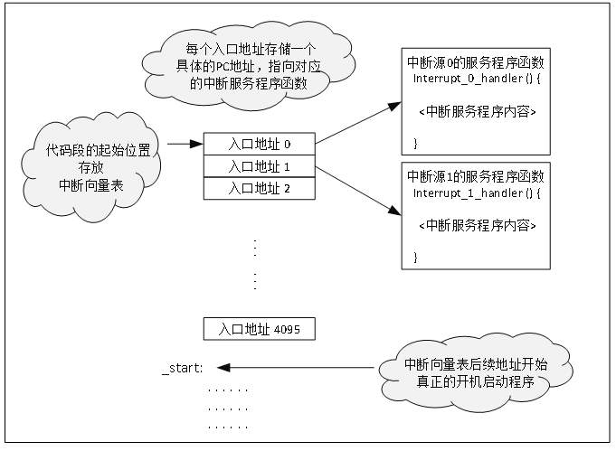
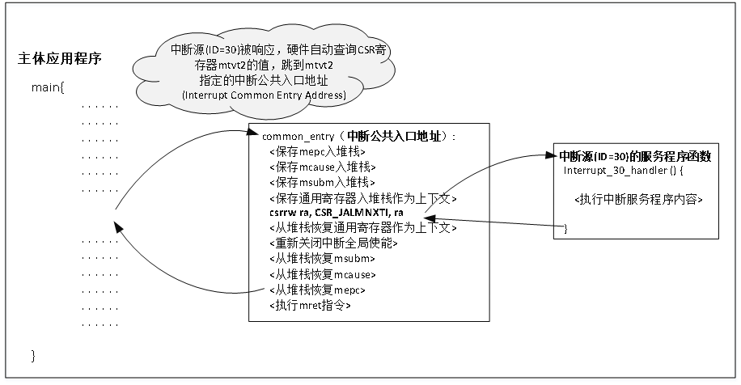
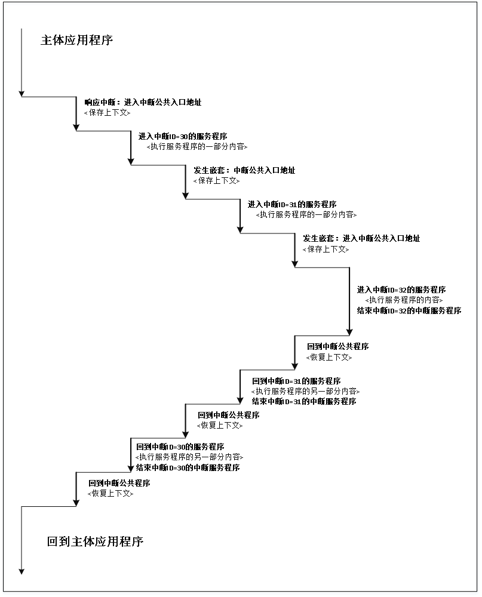
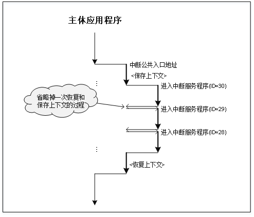
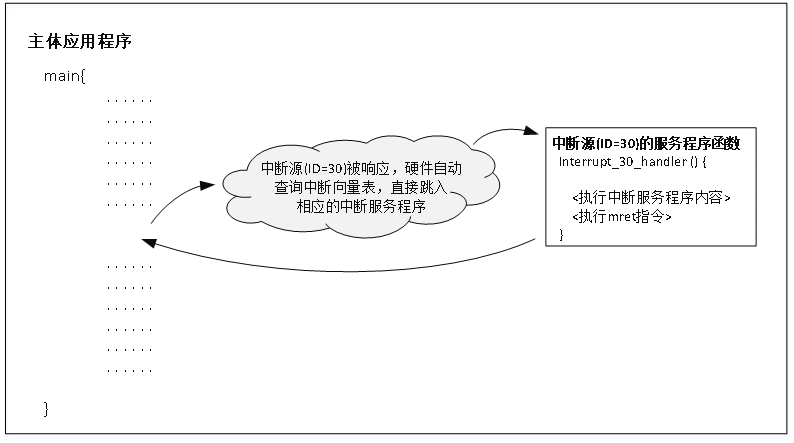
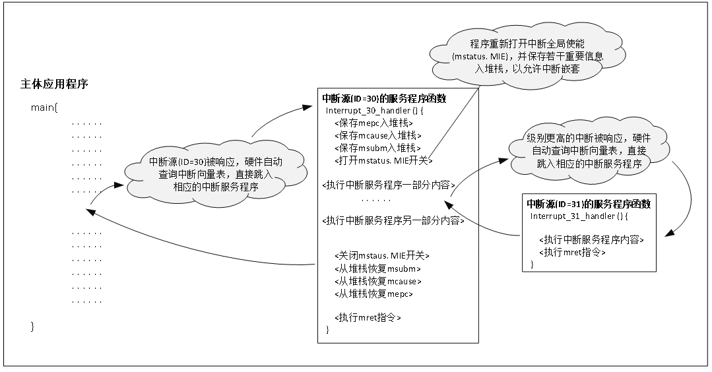
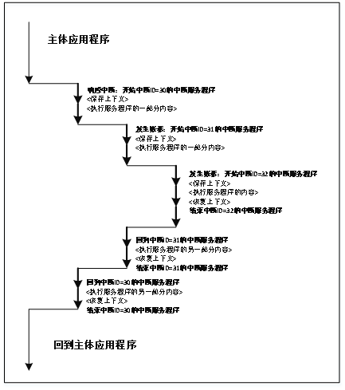

# **5. Bumblebee内核中断机制介绍**

## **5.1. 中断概述**

中断（Interrupt）机制，即处理器内核在顺序执行程序指令流的过程中突然被别的请求打断而中止执行当前的程序，转而去处理别的事情，待其处理完了别的事情，然后重新回到之前程序中断的点继续执行之前的程序指令流。

中断的若干基本知识要点如下：

- 打断处理器执行的“别的请求”便称之为中断请求（Interrupt Request），“别的请求”的来源便称之为中断源（Interrupt Source），中断源通常来自于内核外部（称之为外部中断源），也可以来自于内核内部（成为内部中断源）。
- 处理器转而去处理的“别的事情”便称之为中断服务程序（Interrupt Service Routine，ISR）。
- 中断处理是一种正常的机制，而非一种错误情形。处理器收到中断请求之后，需要保存当前程序的现场，简称为“保存现场”。等到处理完中断服务程序后，处理器需要恢复之前的现场，从而继续执行之前被打断的程序，简称为“恢复现场”。
- 可能存在多个中断源同时向处理器发起请求的情形，需要对这些中断源进行仲裁，从而选择哪个中断源被优先处理。此种情况称为“中断仲裁”，同时可以给不同的中断分配级别和优先级以便于仲裁，因此中断存在着“中断级别”和“中断优先级”的概念。

## **5.2. 中断控制器ECLIC**

如第7.4.13节中所述，通过软件的不同配置，Bumblebee内核支持“默认中断模式”和“ECLIC中断模式”，推荐使用“ECLIC中断模式”，本文仅对“ECLIC中断模式”进行介绍。

Bumblebee内核实现了一个“改进型内核中断控制器（Enhanced Core Local Interrupt Controller，ECLIC）”，可用于多个中断源的管理。Bumblebee内核中的所有类型（除了调试中断之外）的中断都由ECLIC统一进行管理，有关ECLIC的详情请参见第6.2节。有关Bumblebee内核支持的所有中断类型的介绍请参见第5.3节。

## **5.3. 中断类型**

Bumblebee内核支持的中断类型如图 5-1中所示。

​                                                              **
图 5-1 中断类型示意图
**

下文将分别予以详述。

### **5.3.1. 外部中断**

外部中断是指来自于处理器核外部的中断。外部中断可供用户连接外部中断源，譬如外部设备UART、GPIO等产生的中断。

注意：Bumblebee内核支持多个外部中断源，所有外部中断都由ECLIC进行统一管理。

### **5.3.2. 内部中断**

Bumblebee内核有几种内核私有的内部中断，分别为：

- 软件中断（Software Interrupt）
- 计时器中断（Timer Interrupt）

注意：Bumblebee内核的内部中断也都由ECLIC进行统一管理。

#### **5.3.2.1 软件中断**

软件中断要点如下：

- Bumblebee内核实现了一个TIMER单元，TIMER单元里定义了一个msip寄存器，通过其可以产生软件中断，请参见第6.1.6节了解其详情。
- 注意：软件中断也由ECLIC进行统一管理。

#### **5.3.2.2 计时器中断**

计时器中断要点如下：

- Bumblebee内核实现了一个TIMER单元，TIMER单元里定义了一个计时器，通过其可以产生计时器中断，请参见第6.1.5节了解其详情。
- 注意：计时器中断也由ECLIC进行统一管理。

#### **5.3.2.3 存储器访问错误中断**

 “存储器访问错误异常”转化的中断要点如下：

- 当Bumblebee内核遭遇“存储器访问错误异常”时，并不会产生异常，而是会被转化成为相应的内部中断，当做一种中断来处理。

## **5.4. 中断屏蔽**

### **5.4.1. 中断全局屏蔽**

Bumblebee内核的中断可以被屏蔽掉，CSR寄存器mstatus的MIE域控制中断的全局使能。请参见第7.4.8节了解详情。

### **5.4.2. 中断源单独屏蔽**

对于不同的中断源而言，ECLIC为每个中断源分配了各自的中断使能寄存器，用户可以通过配置ECLIC寄存器来管理各个中断源的屏蔽，请参见第6.2.6节了解其详情。

## **5.5. 中断级别、优先级与仲裁**

当多个中断同时出现时，需要进行仲裁。对于Bumblebee内核处理器而言，ECLIC统一管理所有的中断。ECLIC为每个中断源分配了各自的中断级别和优先级寄存器，用户可以通过配置ECLIC寄存器来管理各个中断源的级别和优先级，当多个中断同时发生时，ECLIC会仲裁出级别和优先级最高的中断，如图 5-2中所示。请参见第6.2.9节了解其详情。

​                                                                 **
图 5-2 中断仲裁示意图
**

## **5.6. 进入中断处理模式**

响应中断时，Bumblebee内核的硬件行为可以简述如下。注意，下列硬件行为在一个时钟周期内同时完成：

- 停止执行当前程序流，转而从新的PC地址开始执行。
- 进入中断不仅会让处理器跳转到上述的PC地址开始执行，还会让硬件同时更新其他几个CSR寄存器，如图 5-4所示，分别是以下几个寄存器：
  - mepc（Machine Exception Program Counter）
  - mstatus（Machine Status Register）
  - mcause（Machine Cause Register）
  - mintstatus （Machine Interrupt Status Register）
- 除此之外，进入中断还会更新处理器内核的Privilege Mode以及Machine Sub-Mode。
- 总体过程如图 5-3中所示。

​                                                                   **
图 5-3 响应中断总体过程
**

下文将分别予以详述。

### **5.6.1. 从新的PC地址开始执行**

ECLIC的每个中断源均可以设置成向量或者非向量处理（通过寄存器clicintattr[i]的shv域），其要点如下：

- 如果被配置成为向量处理模式，则该中断被处理器内核响应后，处理器直接跳入该中断的向量入口（Vector Table Entry）存储的目标地址。有关中断向量表的详细介绍，请参见第5.8节，有关向量处理模式的详细介绍，请参见第5.13.2节。
- 如果被配置成为非向量处理模式，则该中断被处理器内核响应后，处理器直接跳入所有中断共享的入口地址。有关中断非向量处理模式的详细介绍，请参见第5.13.1节。

### **5.6.2. 更新Privilege Mode**

在进入中断时，处理器内核的Privilege Mode被更新为Machine Mode。

### **5.6.3. 更新Machine Sub-Mode**

Bumblebee内核的Machine Sub-Mode实时反映在CSR寄存器msubm.TYP域中。在进入中断时，处理器内核的Machine Sub-Mode被更新为中断处理模式，因此：

- CSR寄存器msubm.PTYP域的值被更新为中断发生前的Machine Sub-Mode（msubm.TYP域的值），如图 5-4所示。msubm.PTYP域的作用是在中断结束之后，能够使用msubm.PTYP的值恢复出中断发生之前的Machine Sub-Mode值。
- CSR寄存器msubm.TYP域的值则被更新为“中断处理模式”，如图 5-4所示，以实时反映当前的模式已经是“中断处理模式”。

### **5.6.4. 更新CSR寄存器mepc**

Bumblebee内核退出中断时的返回地址由CSR寄存器mepc指定。在进入中断时，硬件将自动更新mepc寄存器的值，该寄存器将作为退出中断的返回地址，在中断结束之后，能够使用它保存的PC值回到之前被停止执行的程序点。

注意：

- 出现中断时，中断返回地址mepc被指向一条指令，此指令因为中断的出现而未能完成执行。那么在退出中断后，程序便会回到之前的程序点，从mepc所存储的未执行完的指令开始重新执行。
- 虽然mepc寄存器会在中断发生时自动被硬件更新，但是mepc寄存器本身也是一个可读可写的寄存器，因此软件也可以直接写该寄存器以修改其值。

### **5.6.5. 更新CSR寄存器mcause和mstatus**

mcause寄存器的详细格式如表 7-6所示。Bumblebee内核在进入中断时，CSR寄存器mcause被同时（硬件自动）更新，如图 5-4所示，详情如下：

- 当前的中断被响应后，需要有一种机制能够记录当前这个中断源的ID编号。
  - Bumblebee内核在进入中断时，CSR寄存器mcause.EXCCODE域被更新以反映当前响应的ECLIC中断源的ID编号，因此软件可以通过读此寄存器查询中断源的具体ID。
- 当前的中断被响应，有可能是打断了之前正在处理的中断（中断级别相对低，因此可以被打断），需要有一种机制能够记录被打断中断的中断级别（Interrupt Levels）。
  - Bumblebee内核在进入中断时，CSR寄存器mcause.MPIL域被更新以反映被打断的中断级别（mintstatus.MIL域的值）。mcause.MPIL域的作用是在中断结束之后，能够使用mcause.MPIL的值恢复出中断发生之前的mintstatus.MIL值。
- 当前的中断被响应后，需要有一种机制能够记录响应中断之前的中断全局使能状态和特权模式。
  - Bumblebee内核在进入中断时，CSR寄存器mstatus.MPIE域的值被更新为中断发生前中断的全局使能状态（mstatus.MIE域的值）。mstatus.MIE域的值则被更新成为0（意味着进入中断服务程序后中断被全局关闭，所有的中断都将被屏蔽不响应）。
  - Bumblebee内核在进入中断时，处理器的当前特权模式（Privilege Mode）切换到机器模式（Machine Mode），而CSR寄存器mstatus.MPP域的值被更新为中断发生前特权模式（Privilege Mode）。
- 当前响应的中断如果是向量处理模式，则处理器响应中断后会直接跳入该中断的向量入口（Vector Table Entry）存储的目标地址。有关中断向量处理模式的详细介绍，请参见第5.13.2节。从硬件实现上来说，处理器需要分“两步走”，第一步从中断向量表中取出存储的目标地址，然后第二步再跳转到目标地址中去。那么，在第一步“从中断向量表中取出存储的目标地址”这个存储器访问操作的过程中有可能会发生存储器访问错误，需要有一种机制能够记录这种特殊的存储器访问错误。
  - Bumblebee内核在进入中断时，如果该中断是向量处理模式，CSR寄存器mcause.minhv域的值被更新为1，直到上述“两步走”操作彻底成功完成后mcause.minhv域的值清除为0。假设中途发生了存储器访问错误，则最终处理器会发生指令访问错误（Instruction access fault），且mcause.minhv域的值为1（没有被清除）。
- 注意：mstatus.MPIE域和mstatus.MPP域的值与mcause.MPIE域和mcause.MPP域的值是镜像关系，即，在正常情况下，mstatus.MPIE域的值与mcause.MPIE域的值总是完全一样，mstatus.MPP域的值与mcause.MPP域的值总是完全一样。

​                                                       **
图 5-4 进入/退出中断时CSR寄存器的变化
**

## **5.7. 退出中断处理模式**

当程序完成中断处理之后，最终需要从中断服务程序中退出，并返回主程序。由于中断处理处于Machine Mode下，所以退出中断时，软件必须使用mret指令。处理器执行mret指令后的硬件行为如下。注意，下列硬件行为在一个时钟周期内同时完成：

- 停止执行当前程序流，转而从CSR寄存器mepc定义的PC地址开始执行。
- 执行mret指令不仅会让处理器跳转到上述的PC地址开始执行，还会让硬件同时更新其他几个CSR寄存器，如图 5-4所示，分别是以下几个寄存器：
  - mstatus（Machine Status Register）
  - mcause（Machine Cause Register）
  - mintstatus（Machine Interrupt Status Register）
- 除此之外，进入中断还会更新处理器内核的Privilege Mode以及Machine Sub-Mode。

​                                                             **
图 5-5 退出中断总体过程
**

下文将分别予以详述。

### **5.7.1. 从mepc定义的PC地址开始执行**

在进入中断时，mepc寄存器被同时更新，以反映当时遇到中断时的PC值。软件必须使用mret指令退出中断，执行mret指令后处理器将从mepc定义的pc地址重新开始执行。通过这个机制，意味着mret指令执行后处理器回到了当时遇到中断时的PC地址，从而可以继续执行之前被中止的程序流。

### **5.7.2. 更新CSR寄存器mcause和mstatus**

mcause寄存器的详细格式如表 7-6所示，执行mret指令后，硬件将自动更新CSR寄存器mcause的某些域：

- 在进入中断时，mcause.MPIL的值曾经被更新为中断发生前的mintstatus.MIL值。而使用mret指令退出中断后，硬件将mintstatus.MIL的值恢复为mcause.MPIL的值。通过这个机制，则意味着退出中断后，处理器的mintstatus.MIL值被恢复成中断发生之前的值。
- 在进入中断时，mcause.MPIE的值曾经被更新为中断发生前的mstatus.MIE值。而使用mret指令退出中断后，硬件将mret指令执行后，将mstatus.MIE的值恢复为mcause.MPIE的值，如图 5-4所示。通过这个机制，则意味着退出中断后，处理器的mstatus.MIE值被恢复成中断发生之前的值。
- 在进入中断时，mcause.MPP的值曾经被更新为中断发生前的特权模式（Privilege Mode）。而使用mret指令退出中断后，硬件将处理器特权模式（Privilege Mode）恢复为mcause.MPP的值，如图 5-4所示。通过这个机制，则意味着退出中断后，处理器的特权模式（Privilege Mode）被恢复成中断发生之前的模式。
- 注意：mstatus.MPIE域和mstatus.MPP域的值与mcause.MPIE域和mcause.MPP域的值是镜像关系，即，在正常情况下，mstatus.MPIE域的值与mcause.MPIE域的值总是完全一样，mstatus.MPP域的值与mcause.MPP域的值总是完全一样。

### **5.7.3. 更新Privilege Mode**

在执行mret指令后，硬件将自动更新处理器的Privilege Mode为mcause.MPP域的值：

- 在进入中断时，mcause.MPP的值曾经被更新为中断发生前的特权模式（Privilege Mode）。而使用mret指令退出中断后，硬件将处理器特权模式（Privilege Mode）恢复为mcause.MPP的值。通过这个机制，则意味着退出中断后，处理器的特权模式（Privilege Mode）被恢复成中断发生之前的模式。

### **5.7.4. 更新Machine Sub-Mode**

Bumblebee内核的Machine Sub-Mode实时反映在CSR寄存器msubm.TYP域中。在执行mret指令后，硬件将自动恢复处理器的Machine Sub-Mode为msubm.PTYP域的值：

- 在进入中断时，msubm.PTYP域的值曾经被更新为中断发生前的Machine Sub-Mode值。而使用mret指令退出中断后，硬件将处理器Machine Sub-Mode的值恢复为msubm.PTYP域的值，如图 5-4所示。通过这个机制，则意味着退出中断后，处理器的Machine Sub-Mode被恢复成中断发生之前的Machine Sub-Mode。

## **5.8. 中断向量表**

如图 5-6中所示，中断向量表是指在存储器里面开辟的一段连续的地址空间，该地址空间的每个字（Word）用于存储ECLIC每个中断源对应的中断服务程序（Interrupt Service Routine，ISR）函数的PC地址。

中断向量表的起始地址由CSR寄存器mtvt指定，通常可以将mtvt寄存器设置为整个代码段的起始位置。

中断向量表的作用非常重要，当处理器响应某个中断源后，无论中断是向量处理模式还是非向量处理模式，硬件最终都将通过查询中断向量表中存储的PC地址跳转到其对应的中断服务程序函数中去，请参见第5.13节了解更多详细介绍。

​                                                                 **
图 5-6 中断向量表示意图
**

## **5.9. 进出中断的上下文保存和恢复**

RISC-V架构的处理器在进入和退出中断处理模式时没有硬件自动保存和恢复上下文（通用寄存器）的操作，因此需要软件明确地使用（汇编语言编写的）指令进行上下文的保存和恢复。根据中断是向量处理模式还是非向量处理模式，上下文的保存和恢复涉及到的内容会有所差异，请参见第5.13节了解更多详细介绍。

## **5.10. 中断响应延迟**

中断响应延迟的概念通常是指，从“外部中断源拉高”到“处理器真正开始执行该中断源对应的中断服务程序（Interrupt Service Routine，ISR）中的第一条指令”所消耗的指令周期数。因此，中断响应延迟通常会包含如下几个方面的周期开销：

- 处理器内核响应中断后进行跳转的开销
- 处理器内核保存上下文所花费的周期开销
- 处理器内核跳转到中断服务程序（Interrupt Service Routine，ISR）中去的开销。

取决于中断是向量处理模式还是非向量处理模式，中断响应延迟会有所差异，请参见第5.13节了解更多详细介绍。

## **5.11. 中断嵌套**

处理器内核正在处理某个中断的过程中，可能有一个级别更高的新中断请求到来，处理器可以中止当前的中断服务程序，转而开始响应新的中断，并执行其“中断服务程序”，如此便形成了中断嵌套（即前一个中断还没响应完，又开始响应新的中断），并且嵌套的层次可以有很多层。

以图 5-7中的示例为例：

- 假设处理器正在处理计时器中断，突然有另外一个按键1中断到来（级别比计时器中断高），那么处理器会暂停处理计时器中断，开始处理按键1中断。
- 但是突然又有另外一个按键2中断到来（级别比按键1中断更高），那么处理器会暂停处理按键1的中断，开始处理按键2中断。
- 之后再没有其他更高级别的中断到来，则按键2中断不会再被打断，处理器能够顺利处理完毕按键2的中断，然后重新回到按键1中断的处理程序中去，完成按键1中断的处理。
- 完成按键1中断的处理之后，处理器会重新回到计时器中断的处理程序中去，完成计时器中断的处理。

​                                                                    **
图 5-7 中断嵌套示意图
**

注意：假设新来的中断请求的优先级比正在处理的中断级别低（或者相同），则处理器不应该响应这个新的中断请求，处理器必须完成当前的中断服务程序之后才考虑响应新的中断请求（因为新中断请求的级别并不比当前正在处理的中断级别高）。有关中断级别的设定请参见第6.2.9节了解更多信息。

在Bumblebee内核中，取决于中断是向量处理模式还是非向量处理模式，中断嵌套的支持方法会有所差异，请参见第5.13节了解更多详细介绍

## **5.12. 中断咬尾**

处理器内核正在处理某个中断的过程中，可能有新中断请求到来，但是“新中断的级别”低于或者等于“当前正在处理的中断级别”，因此，新中断不能够打断当前正在处理的中断（因此不会形成嵌套）。

当处理器完成当前中断之后，理论上需要恢复上下文，然后退出中断回到主应用程序，然后重新响应新的中断，响应新的中断又需要再次保存上下文。因此，存在着一次背靠背的“恢复上下文”和“保存上下文”操作，如果将此背靠背的“恢复上下文”和“保存上下文”省略掉，则称之为“中断咬尾”，如图 5-8中所示，显而易见，中断咬尾可以加快多个中断的背靠背处理速度。

​                                                                 **
图 5-8 中断咬尾示意图
**

在Bumblebee内核中，只有非向量处理模式才支持中断咬尾，请参见第5.13.1.3节了解更多详细介绍。

## **5.13. 中断的向量处理模式和非向量处理模式**

如第6.2.10节中所述，ECLIC的每个中断源均可以设置成向量或者非向量处理（通过寄存器clicintattr[i]的shv域），向量处理模式和非向量处理模式二者有较大的差别，分别介绍如下。

### **5.13.1. 非向量处理模式**

#### **5.13.1.1 非向量处理模式的特点和延迟**

如果被配置成为非向量处理模式，则该中断被处理器内核响应后，处理器会直接跳入到所有非向量中断共享的入口地址，该入口地址可以通过软件进行设置：

- 如果配置CSR寄存器mtvt2的最低位为0（上电复位默认值），则所有非向量中断共享的入口地址由CSR寄存器mtvec的值（忽略最低2位的值）指定。由于mtvec寄存器的值也指定异常的入口地址，因此，意味着在这种情况下，异常和所有非向量中断共享入口地址。
- 如果配置CSR寄存器mtvt2的最低位为1，则所有非向量中断共享的入口地址由CSR寄存器mtvt2的值（忽略最低2位的值）指定。为了让中断以尽可能快的速度被响应和处理，推荐将CSR寄存器mtvt2的最低位设置为1，即，由mtvt2指定一个独立的入口地址供所有非向量中断专用，和异常的入口地址（由mtvec的值指定）彻底分开。
- 在进入所有非向量中断共享的入口地址之后，处理器会开始执行一段共有的软件代码，如图 5-9中所示的例子，这段软件代码内容通常如下：
- 首先保存CSR寄存器mepc、mcause、msubm入堆栈。保存这几个CSR寄存器是为了保证后续的中断嵌套能够功能正确，因为新的中断响应会重新覆盖mepc、mcause、msubm的值，因此需要将它们先保存入堆栈。
- 保存若干通用寄存器（处理器的上下文）入堆栈。
- 然后执行一条特殊的指令“csrrw ra， CSR_JALMNXTI， ra”。如果没有中断在等待（Pending），则该指令相当于是个Nop指令不做任何操作；如果有中断在等待（Pending），执行该指令后处理器会：
  - 直接跳入该中断的向量入口（Vector Table Entry）存储的目标地址，即该中断源的中断服务程序（Interrupt Service Routine，ISR）中去。
  - 在跳入中断服务程序的同时，硬件也会同时打开中断的全局使能，即，设置mstatus寄存器的MIE域为1。打开中断全局使能后，新的中断便可以被响应，从而达到中断嵌套的效果。
  - 在跳入中断服务程序的同时，“csrrw ra， CSR_JALMNXTI， ra”指令还会达到JAL（Jump and Link）的效果，硬件同时更新Link寄存器的值为该指令的PC自身作为函数调用的返回地址。因此，从中断服务程序函数返回后会回到该“csrrw ra， CSR_JALMNXTI， ra”指令重新执行，重新判断是否还有中断在等待（Pending），从而达到中断咬尾的效果。
  - 在中断服务程序的结尾处同样需要添加对应的恢复上下文出栈操作。并且在CSR寄存器mepc、mcause、msubm出堆栈之前，需要将中断全局使能再次关闭，以保证mepc、mcause、msubm恢复操作的原子性（不被新的中断所打断）。

​                                                **
图 5-9 中断的非向量处理模式示例（总是支持嵌套）
**

由于非向量处理模式时处理器在跳到中断服务程序之前需要先执行一段共有的软件代码进行上下文的保存，因此，从中断源拉高到处理器开始执行中断服务程序中的第一条指令，需要经历以下几个方面的时钟周期开销：

- 处理器内核响应中断后进行跳转的开销。理想情况下约4个时钟周期。
- 处理器内核保存CSR寄存器mepc、mcause、msubm入堆栈的开销。
- 处理器内核保存上下文所花费的周期开销。如果是RV32E的架构，则需要保存8个通用寄存器，如果是RV32I的架构，则需要保存16个通用寄存器。
- 处理器内核跳转到中断服务程序（Interrupt Service Routine，ISR）中去的开销。理想情况下约需要5个时钟周期。

#### **5.13.1.2 非向量处理模式的中断嵌套**

如上文所述，非向量处理模式总是能够支持中断嵌套，如图 510中所示的示例：假设中断源30、31、32这三个中断源先后到来，且“中断源32的级别” > “中断源31的级别”> “中断源30的级别”，那么后来的中断便会打断之前正在处理的中断形成中断嵌套。

​                                         **
图 5-10 三个先后到来的（非向量处理模式）中断形成嵌套
**

#### **5.13.1.3 非向量处理模式的中断咬尾**

对于非向量处理模式的中断而言，由于在跳入和退出中断服务程序之前，处理器要进行上下文的保存和恢复，因此进行“中断咬尾”能够节省显著的时间（节省一次背靠背的保存上下文和恢复上下文）。

如上文所述，在所有非向量中断共享的共有代码段中，在跳入中断服务程序的同时，“csrrw ra， CSR_JALMNXTI， ra”指令还会达到JAL（Jump and Link）的效果，硬件同时更新Link寄存器的值为该指令的PC自身作为函数调用的返回地址。因此，从中断服务程序函数返回后会回到该“csrrw ra， CSR_JALMNXTI， ra”指令重新执行，重新判断是否还有中断在等待（Pending），从而达到中断咬尾的效果。

如图 5-11中所示的示例：假设中断源30、29、28这三个中断源先后到来，且“中断源30的级别” >= “中断源29的级别”>= “中断源28的级别”，那么后来的中断不会打断之前正在处理的中断（不会形成中断嵌套），但是会被置于等待（Pending）状态。当中断源30完成处理后，将会直接开始中断源29的中断处理，省掉中间的“恢复上下文”和“保存上下文”过程。

​                                                              **
图 5-11 中断咬尾示意图
**

### **5.13.2. 向量处理模式**

#### **5.13.2.1 向量处理模式的特点和延迟**

如果被配置成为向量处理模式，则该中断被处理器内核响应后，处理器会直接跳入该中断的向量入口（Vector Table Entry）存储的目标地址，即该中断源的中断服务程序（Interrupt Service Routine，ISR），如图 5-12中所示的例子。

​                                                             **
图 5-12 中断的向量处理模式示例
**

向量处理模式具有如下特点：

- 向量处理模式时处理器会直接跳到中断服务程序，并没有进行上下文的保存，因此，中断响应延迟非常之短，从中断源拉高到处理器开始执行中断服务程序中的第一条指令，基本上只需要硬件进行查表和跳转的时间开销，理想情况下约6个时钟周期。
- 对于向量处理模式的中断服务程序函数，一定要使用特殊的____attribute____((interrupt))来修饰中断服务程序函数。
- 向量处理模式时，由于在跳入中断服务程序之前，处理器并没有进行上下文的保存，因此，理论上中断服务程序函数本身不能够进行子函数的调用（即，必须是Leaf Function）。
  - 如果中断服务程序函数不小心调用了其他的子函数（不是Leaf Function），如果不加处理则会造成功能的错误。为了规避这种不小心造成的错误情形，只要使用了特殊的____attribute____((interrupt)) 来修饰该中断服务程序函数，那么编译器会自动的进行判断，当编译器发现该函数调用了其他子函数时，便会自动的插入一段代码进行上下文的保存。注意：这种情况下虽然保证了功能的正确性，但是由于保存上下文造成的开销，又会事实上还是增大中断的响应延迟（与非向量模式相当）并且造成代码尺寸（Code Size）的膨胀。因此，在实践中，如果使用向量处理模式，那么不推荐在向量处理模式的中断服务程序函数中调用其他的子函数。
- 向量处理模式时，由于在跳入中断服务程序之前，处理器并没有进行任何特殊的处理，且由于处理器内核在响应中断后，mstatus寄存器中的MIE域将会被硬件自动更新成为0（意味着中断被全局关闭，从而无法响应新的中断）。因此向量处理模式默认是不支持中断嵌套的，为了达到向量处理模式且又能够中断嵌套的效果，如图 5-13中所示，需要在中断服务程序的开头处添加特殊的入栈操作：
  - 首先保存CSR寄存器mepc、mcause、msubm入堆栈。保存这几个CSR寄存器是为了保证后续的中断嵌套能够功能正确，因为新的中断响应会重新覆盖mepc、mcause、msubm的值，因此需要将它们先保存入堆栈。
  - 重新打开中断的全局使能，即，设置mstatus寄存器的MIE域为1。打开中断全局使能后，新的中断便可以被响应，从而达到中断嵌套的效果。
  - 在中断服务程序的结尾处同样需要添加对应的恢复上下文出栈操作。并且在CSR寄存器mepc、mcause、msubm出堆栈之前，需要将中断全局使能再次关闭，以保证mepc、mcause、msubm恢复操作的原子性（不被新的中断所打断）。

​                                                     **
图 5-13 中断的向量处理模式示例（支持中断嵌套）
**

#### **5.13.2.2 向量处理模式的中断嵌套**

如上文所述，向量处理模式的中断经过特殊处理也可以支持中断嵌套，如图 5-14中所示的示例：假设中断源30、31、32这三个中断源先后到来，且“中断源32的级别” > “中断源31的级别”> “中断源30的级别”，那么后来的中断便会打断之前正在处理的中断形成中断嵌套。

​                                            **
图 5-14 三个先后到来的（向量处理模式）中断形成嵌套
**

#### **5.13.2.3 向量处理模式的中断咬尾**

对于向量处理模式的中断而言，由于在跳入中断服务程序之前，处理器并没有进行上下文的保存，因此进行“中断咬尾”的意义不大，因此，向量处理模式的中断，没有“中断咬尾”处理能力。

