---

---

# **1. 开发环境准备**<div id="1"></div>

- Development boards: GD32V103V-EVAL-V1.0 board
- Hardware Debugger: J-Link or GD-Link
- Operating system: WIN7 64-bit OS
- IDE: Eclipse IDE for GNU ARM & RISC-V C/C++ Developers (4.7.2)
- RISC-V Toolchains: RISC-V GCC(8.2.0)
- Build Tools: GNU MCU Eclipse build tools
- GDB server: OpenOCD

备注：确保将完整的SDK文件包拷贝至本地的任意英文路径下，使用我们提供的最新版本的OpenOCD。


# **2.使用模板自动建立工程**<div id="2"></div>

## **2.1.启动Eclipse并建立Workspace**<div id="2-1"></div>

**图2-1.Eclipse Launcher**

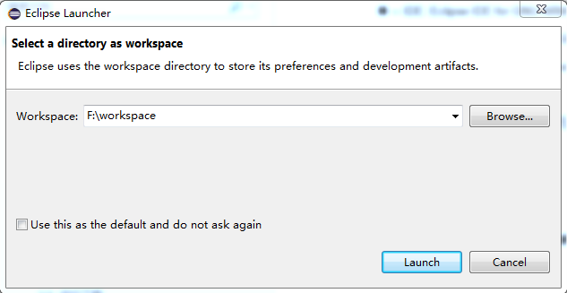 

如图2-1，确保Workspace的路径中没有中文，点击“Launch”。

## **2.2. 选择要建立的工程**<div id="2-2"></div>

在菜单栏中，点击File->New->C/C++ Project，弹出图2-2界面，选择All -> C Managed Build，点击“Next”。

**图2-2. 建立工程示意图**

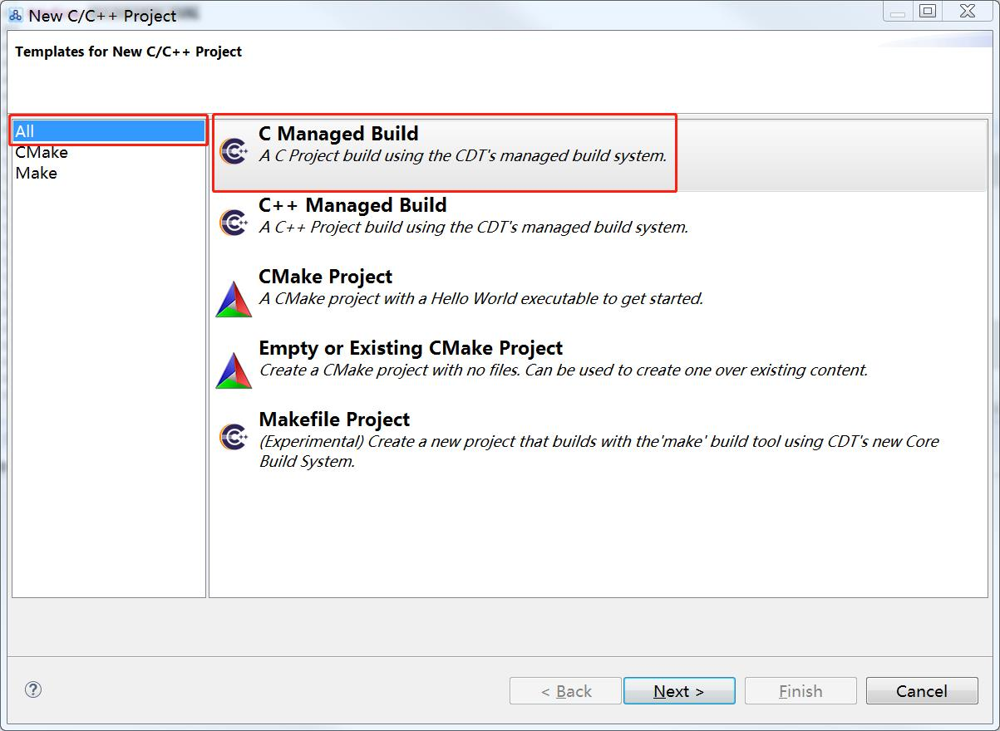 

在Project name处，填入工程名称，同时选择“GigaDevice RISC-V C Project”,点击“Next”。

 

**图2-3. 选择自动创建工程模板**

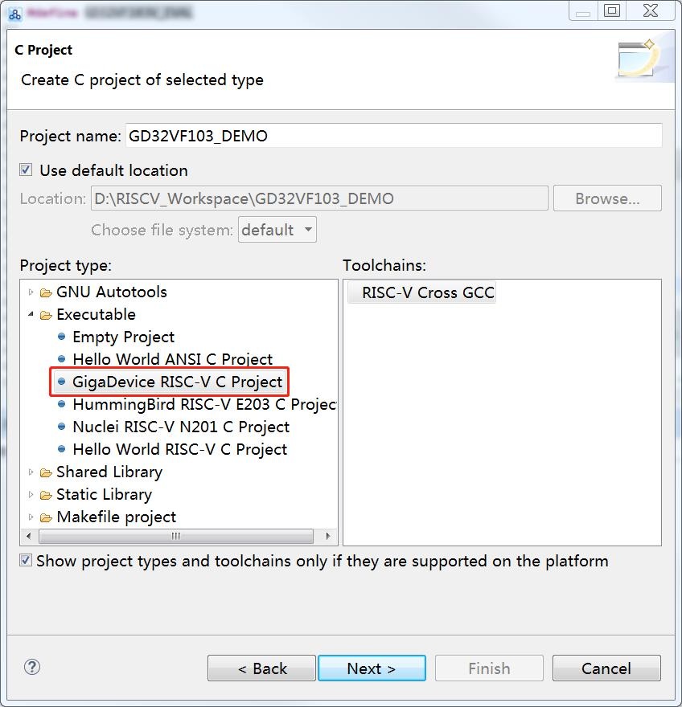 

 

**图2-4. 选择芯片及评估板型号**

 

**图2-5. 选择Demo程序**

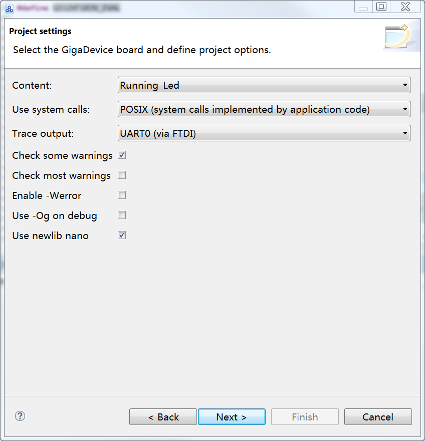 

 

**图2-6. 选择生成配置文件**

 

 

**图2-7.设置GNU MCU RISC-V GCC 路径**

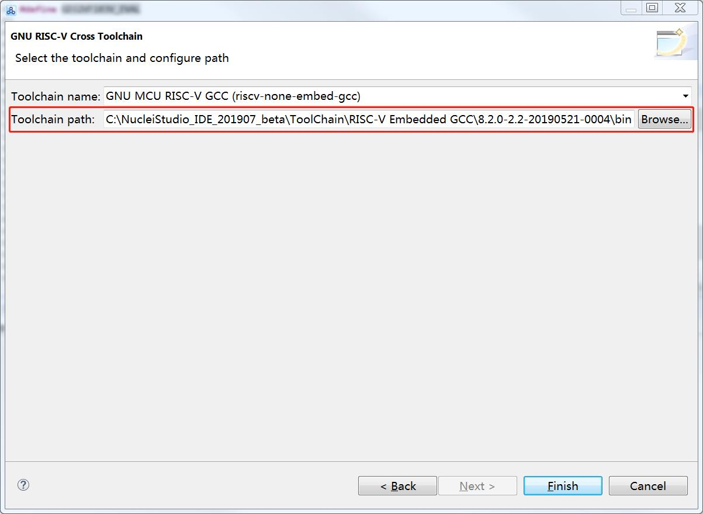 

 

**图2-8. 工程建立完毕**

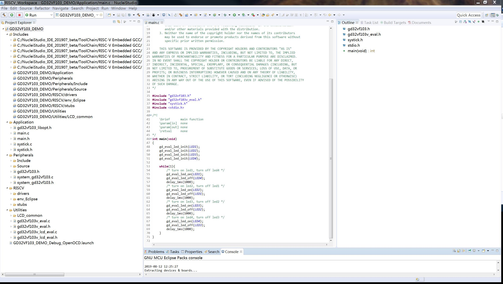 


# **3.设置工具路径**<div id="3"></div>

```
在GD32VF103的工程文件建立之后，已经包含了绝大部分的工程配置，但是仍需手动设置以下两个工具的bin路径（绝对路径）：
```

## **3.1.设置Build Tools Path**<div id="3-1"></div>

右击工程名称，点击Properties进入工程属性，如图3-1所示。

**图3-1. Build Tools路径配置**

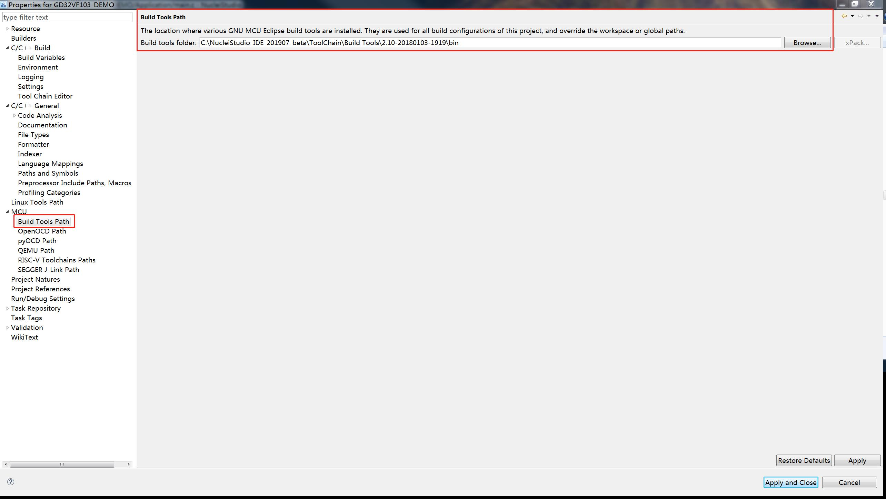 

点击MCU列表中的Build Tools Path选项，为其选择SDK文件包中提供的对应工具。

## **3.2.设置OpenOCD Path**<div id="3-2"></div>

**图3-2. Openocd路径配置**

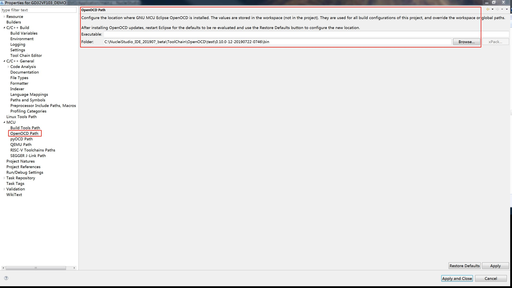 

如图3-2，点击MCU列表中的OpenOCD Path选项，为其选择SDK文件包中提供的对应工具。


# 4.选择具体的芯片型号对应的LDS文件<div id="4"></div>

在自动模板创建工程时，默认使用“GD32VF103xB.lds”。如果对应不同的芯片型号，请手动进行修改即可。

**图4-1根据芯片型号修改LDS文件**

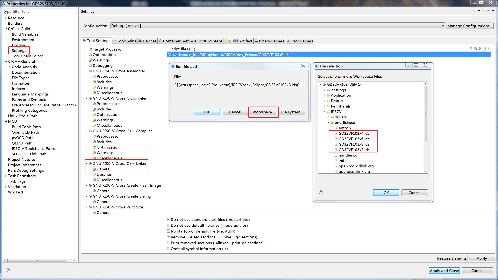 

 

# 5.OpenOCD + GDB调试<div id="5"></div>

```
在菜单栏中，点击Run->Debug Configurations，进入Debug配置界面，可以看到该工程对应的Debug配置文件已经自动生成，如图5-1所示。
```

**图5-1. Debug配置界面**

 

```
我们使用OpenOCD作为GDB Server，使用GCC工具链中的GDB工具作为GDB Client。

同时，可以看到对应GD32VF103芯片的SVD文件已经被自动加载。
```

## **5.1.Debugger选项卡**<div id="5-1"></div>

**图5-2..Debugger选项卡配置界面**

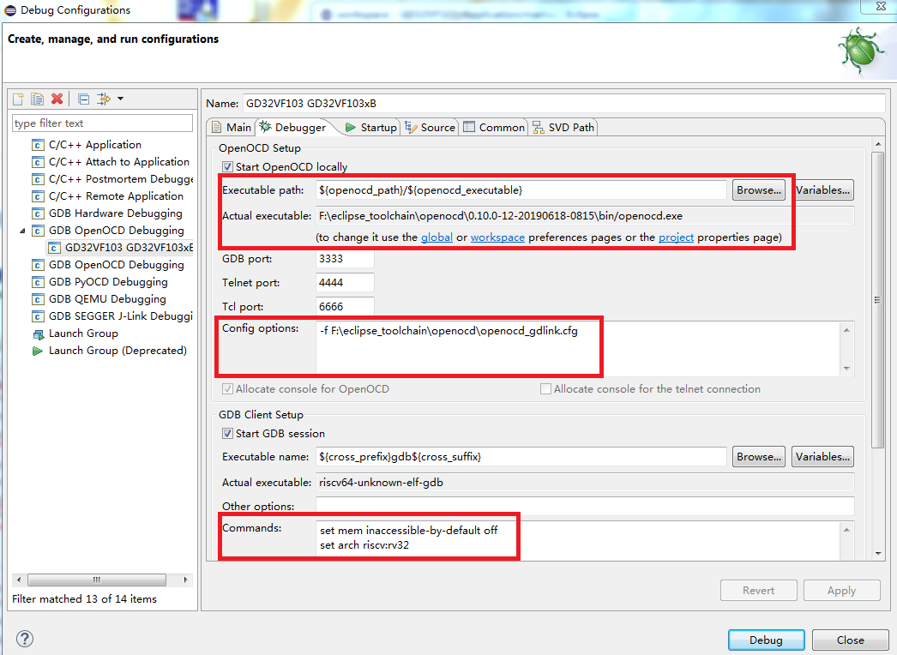 

```
如图5-2，在Debugger选项卡中，红圈中的配置已经自动生成。

其中，“Config options”是为OpenOCD选择配置文件，需要根据当前使用的下载器选择不同的cfg文件。
```

本例中的Config options为：

openocd_gdlink.cfg

**注意**：openocd文件夹内提供了openocd_gdlink.cfg / openocd_jlink.cfg两个个配置文件，对应于不同的调试器使用。使用JLINK时，需要更换驱动，可参考《GD32VF103_JLINK驱动安装_V1.0》文档。推荐使用GDLINK。

## **5.2.** **Startup选项卡**<div id="5-2"></div>

**图5-3**.  **Startup选项卡配置界面**

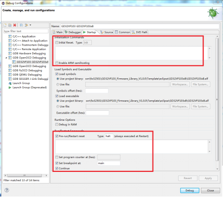 

如图5-3，在Startup选项卡中，红圈中的内容已经被自动配置完毕。

注意：Run/Restart Commands这一栏的配置将会影响对系统复位（引脚复位、软件复位或按钮产生的引脚复位）的调试；另外，还需配合我们提供的最新版本的OpenOCD。

最后，点击Apply，完成GDB调试的配置。点击Debug，即可开始调试该工程。

 

图5-4 **Debug界面**

 

**其中包含了：**

- Debug窗口
- 控制台窗口
- 外设寄存器窗口（观察窗口和寄存器窗口）
- 代码编辑窗口
- 汇编代码窗口
- 处理器寄存器窗口
- 断点信息窗口

